# 0x01 First Glance

该企业查询网站限制普通会员最多查看40条数据。可以通过筛选条件查询

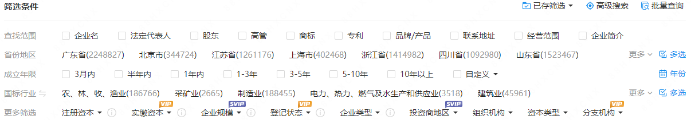

🎯Target：爬取1w+统一社会信用代码

搜索结果中一页最多20条数据，因此每个搜索条件下最多爬取两页

以关键字“餐饮”为例去搜索，发现其实大部分时候，每天成立的企业还挺多的，因此可以遍历成立日期来尽量爬取多的数据

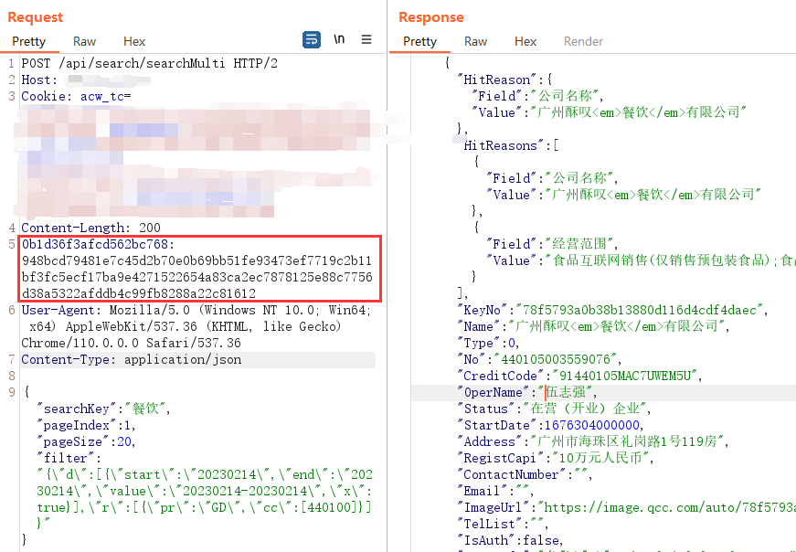

接口为`/api/search/searchMulti` ，repeater去除掉掉可以去除的头字段。

需要找到上面红框字段的生成方式，估计是个摘要算法。

# 0x02 Debug

下了XHR断点，回溯调用栈没啥发现。

由于是往请求头添加字段，试试搜headers关键字。Lucky Guess！！！
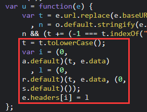

调试可知，t是接口路径，e.data是请求体
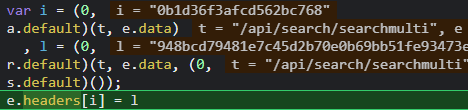

首先看字段名的生成，跟进a.default
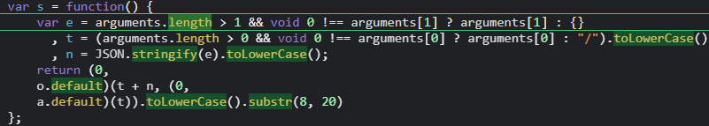

取出参数并转为小写，其中将第二个参数json对象转为json字符串

o.default传入两个参数，第一个是t和n拼接，第二个是a.default(t)得到的

跟进a.default
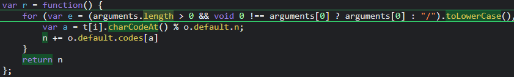

就是对参数进行一些处理，后面模拟的时候直接用python调js的函数就好了

其中o.default.n调试可知为20

o.default.codes也是固定的
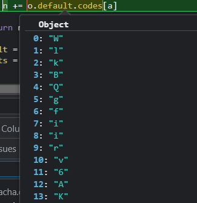

整理一下：

```javascript
var codes = ["W", "l", "k", "B", "Q", "g", "f", "i", "i", "r", "v", "6", "A", "K", "N", "k", "4", "L", "1", "8"];
var r = function () {
    for (var e = (arguments.length > 0 && void 0 !== arguments[0] ? arguments[0] : "/").toLowerCase(), t = e + e, n = "", i = 0; i < t.length; ++i) {
        var a = t[i].charCodeAt() % 20;
        n += codes[a]
    }
    return n
};
```

由于我们使用的就只有这一个接口，直接把这个`a.default(t)`（t为接口名）写死在爬虫程序就可以了，

回退跟进`o.default(t+n ,a.default(t))` 
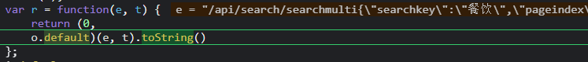

再跟进去
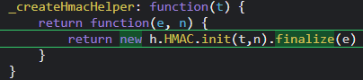

熟悉的HMAC，就是加盐的哈希。这里盐是`a.default(t)`，要哈希的数据是`t+n` 

但看一下返回的长度128个字符。而比较常见的MD5也才32个字符（SHA1 40个字符）

笔者还以为这个前端又魔改了HMAC算法。根据以往经验，就算魔改了，也只是在HMAC入口处或出口处稍作改动，不会改其内部算法

试探性地搜一下`HMAC`
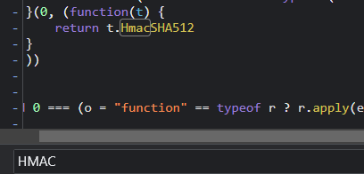

HmacSHA512？？？去在线网站试了试果然是128个字符

python实现如下：

```python
import hmac
import hashlib

res = hmac.new(salt.encode(), data.encode(), digestmod=hashlib.sha512).hexdigest()
```

接着HMAC返回值`subStr(8, 20)`，即从第八个字符开始取20个字符，作为字段名

接着看字段值：


跟进`s.default()`发现返回也是写死的
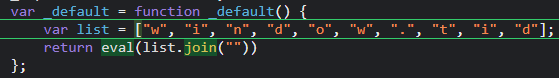

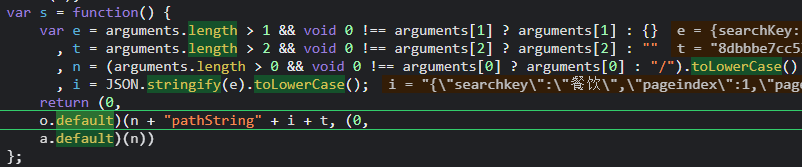

`a.default(n)` 和上面的一样，是对接口名称的处理，写死的

`o.default` 进去的也是HMAC，和上面一样

可以快乐地写脚本了。

# 0x03 Robot Build

```python
import execjs
import hmac
import hashlib
import json
import requests
import datetime

url = 'https://xxx/api/search/searchMulti'
today = datetime.datetime.now()
proxy = {
    'https': '127.0.0.1:8080'
}

with open('foo.js', 'r') as f:
    context = execjs.compile(f.read())
    suffix = "6554a513cb0931121c07fa9e8da5968d"
    path = "/api/search/searchmulti"
    salt = context.call('r', path).encode()
    credit_code = open('credit.txt', 'w')
    for i in range(10000):
        for page in range(2):
            day = (today + datetime.timedelta(days=-15 - i)).strftime("%Y%m%d") # 网站不支持查询近15天成立的企业
            param = {
                'd': [{'start': day, 'end': day, 'value': f'{day}-{day}', 'x': True}],
                'r': [{'pr': 'GD', 'cc': [440100]}]
            }
            headers = {
                'User-Agent': 'Mozilla/5.0 (Windows NT 10.0; Win64; x64) AppleWebKit/537.36 (KHTML, like Gecko) Chrome/110.0.0.0 Safari/537.36',
                'Cookie': 'xxxx',
                'Content-Type': 'application/json'
            }
            obj = {
                "searchKey": "餐饮",
                "pageIndex": page + 1,
                "pageSize": 20,
                "filter": json.dumps(param, separators=(',', ':')) # json.dumps会自动添加多余的空格，separators可以解决
            }
            obj_str = json.dumps(obj, separators=(',', ':'), ensure_ascii=False) # ensure_ascii=False才不会导致中文被unicode编码
            _key = hmac.new(salt, (path + obj_str).lower().encode(), digestmod=hashlib.sha512).hexdigest()[8: 28]
            arg = path + "pathString" + obj_str.lower() + suffix
            _val = hmac.new(salt, arg.encode(), digestmod=hashlib.sha512).hexdigest()
            headers[_key] = _val
            try:
                res = requests.post(url=url, headers=headers, data=json.dumps(obj, ensure_ascii=False).encode('utf-8'),
                                    proxies=proxy,
                                    verify=False).text
                res_text = json.loads(res)
                for item in res_text['Result']:
                    code = item['CreditCode']
                    print(code)
                    credit_code.write(code + '\n')
            except:
                continue
```


