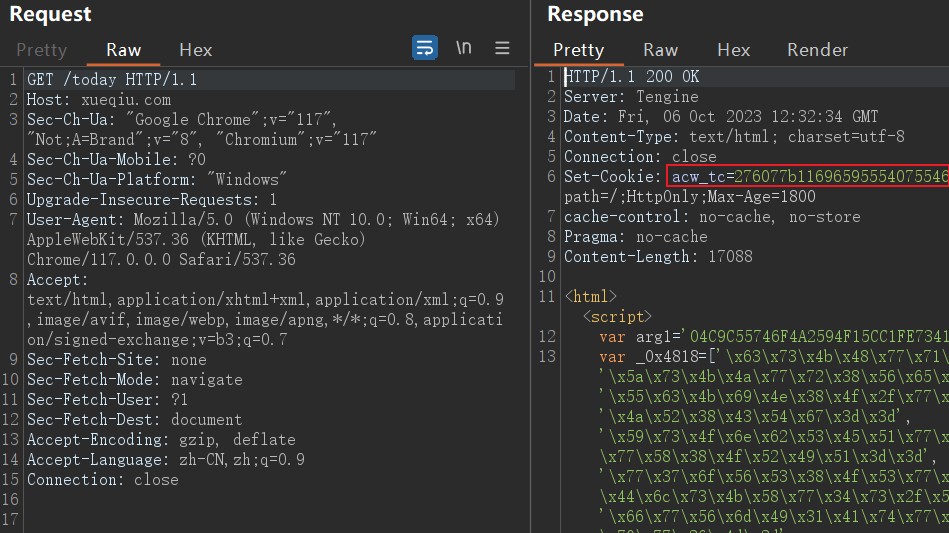
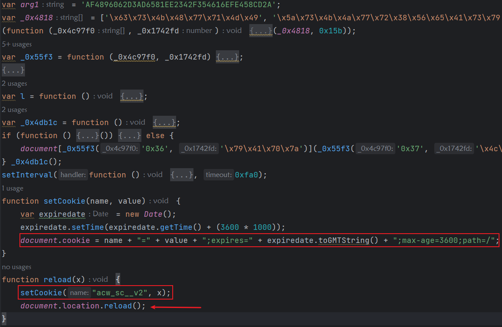
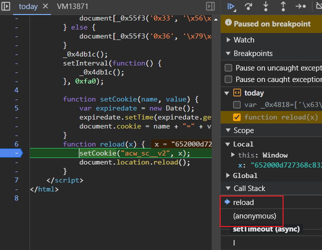
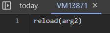
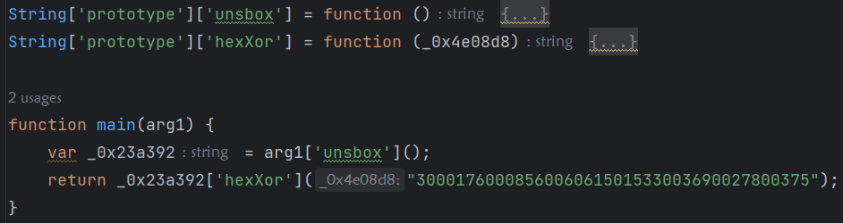
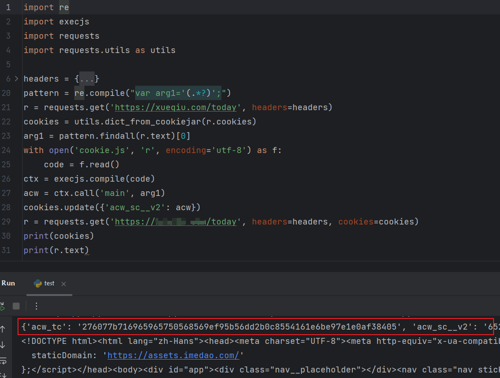

cookie的获取分成多个阶段

1. 请求获取一段JS代码，服务端返回cookie1
2. JS代码生成cookie2，客户端带上cookie1+cookie2访问才返回数据

🎯Target：dWdnY2Y6Ly9raHJkdmgucGJ6L2dicW5s

（备：dWdnY2Y6Ly9qamoucHFnLXJwLnBiei91YnpyL3piZXItbWx0dC51Z3p5）

阿里系的cookie

发现第二次请求多出了一个`acw_sc__v2`

分析第一次请求得到的cookie

设置了`acw_sc__v2`这个cookie并重新加载页面

有无限debugger反调试，F11连续跟进到VM执行上面的代码

往reload上一个调用函数看

文件内搜索`arg2`，下断点

接着控制台边打印边扣代码即可，这里的arg1每次都会变，因此需要通过正则从JS文件提取

（这个JS代码还存在内存爆破，暂时不知道怎么解决）