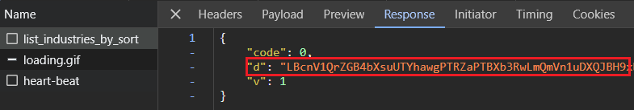
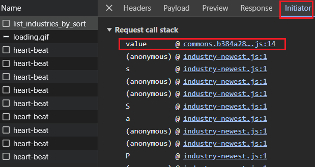
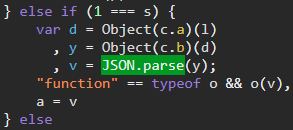
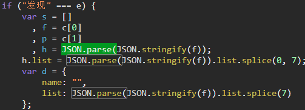
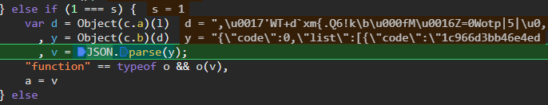
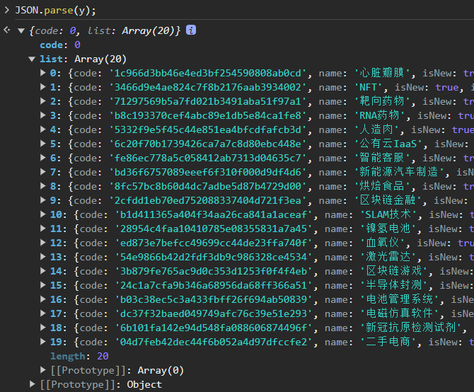
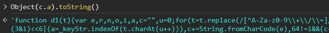
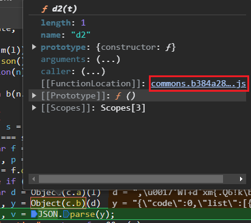

🎯Target：dWdnY2Y6Ly9qamoua3ZhdmhxbmduLnBiei92YXFoZmdlbC9hcmpyZmc/c2Viej1xbmdu

返回的数据为加密数据



加密字段d名字太空泛，无法直接搜索，结合调用栈搜索`JSON.parse`



进入`commons`那个js文件，搜索`JSON.parse(`，找到8处，一一排除

如下这样调用了某个对象的实例方法就可能是解密函数



下面这种就大概率不是解密函数



刷新网页触发断点，这里的l就是返回包中的加密数据



在控制台打印`JSON.parse(y)`的结果，得到解密后的数据



接下来开始扣代码

控制台调用 函数对象的`toString`方法 直接打印函数体



或者在代码中选中整个调用的函数，点击`FunctionLocation`



缺啥补啥就够了

```js
_keyStr = "ABCDEFGHIJKLMNOPQRSTUVWXYZabcdefghijklmnopqrstuvwxyz0123456789+/=";
_p = "W5D80NFZHAYB8EUI2T649RT2MNRMVE2O";

function _u_d(t) {
    let e = "";
    let o = 0, n = 0, r = 0, i = 0;
    for (; r < t.length;) (n = t.charCodeAt(r)) < 128 ? (e += String.fromCharCode(n), r++) : n > 191 && n < 224 ? (o = t.charCodeAt(r + 1), e += String.fromCharCode((31 & n) << 6 | 63 & o), r += 2) : (o = t.charCodeAt(r + 1), i = t.charCodeAt(r + 2), e += String.fromCharCode((15 & n) << 12 | (63 & o) << 6 | 63 & i), r += 3);
    return e
}

function d1(t) {
    var e, r, n, o, i, a, c = "", u = 0;
    for (t = t.replace(/[^A-Za-z0-9\+\/\=]/g, ""); u < t.length;)
        e = _keyStr.indexOf(t.charAt(u++)) << 2 | (o = _keyStr.indexOf(t.charAt(u++))) >> 4,
            r = (15 & o) << 4 | (i = _keyStr.indexOf(t.charAt(u++))) >> 2,
            n = (3 & i) << 6 | (a = _keyStr.indexOf(t.charAt(u++))),
            c += String.fromCharCode(e),
        64 != i && (c += String.fromCharCode(r)),
        64 != a && (c += String.fromCharCode(n));
    return c
}

function d2(t) {
    for (var e = "", r = 0; r < t.length; r++) {
        var n = _p.charCodeAt(r % _p.length);
        e += String.fromCharCode(t.charCodeAt(r) ^ n)
    }
    return e = _u_d(e)
}

function decrypt(l) {
    return JSON.parse(d2(d1(l)));
}
```

```python
# PyExecJS不再更新和维护
import execjs  # pip install PyExecJS2

with open('test.js', 'rb') as f:
    code = f.read()

ctx = execjs.compile(code.decode('utf-8'))
cipher = 'LBc0XUI9KTQXFConShMaawg6Q1hVfnZRIio3b2x1Tw=='
result = ctx.call('decrypt', cipher)
print(result)
```

