🎯Target：dWdnYzovL2pqai5mY2J5dnBsLnBiei9nbGNyY2J5dnBs

一进去就有无限debugger，这时候右击never pause here就没用了，因为无限的函数调用让内存溢出了

查看调用栈上一个函数

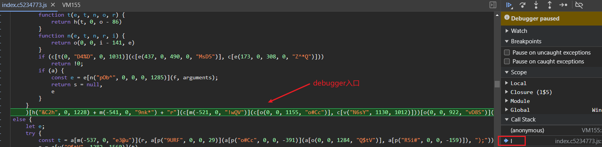

有混淆，放控制台打印查看得到

`(function(){xxxx})['constructor']("debugger").call('action')`

就是利用Function对象的构造器构造了一个debugger

利用控制台hook，当传入构造器的参数为`debugger`时返回空函数

```js
ctr = Function.prototype.constructor;
Function.prototype.constructor = function (name) {
    if(name === "debugger") {
        return function () {};
    }
    return ctr(name);
};
```

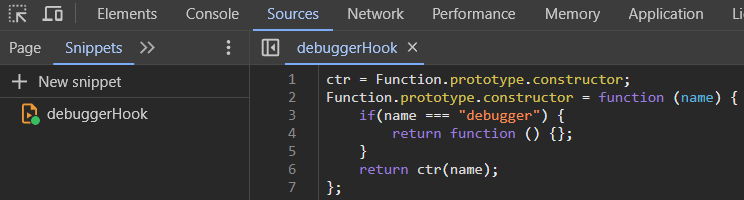

再点击右下角的Ctrl+Enter完成hook，放行后就没有无限debugger了

点击公示公告

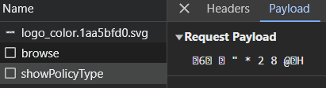

发现接口的请求体为乱码，返回包为正常数据

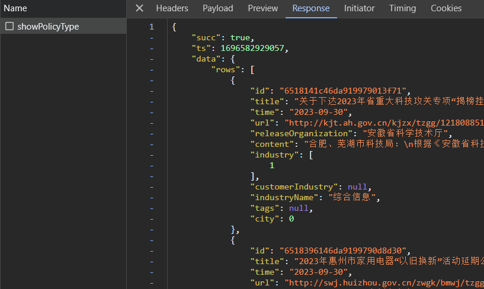

下XHR断点

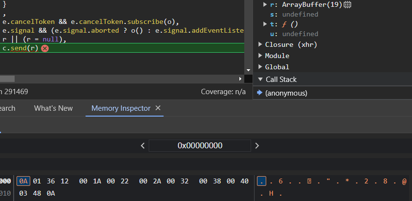

这里的r就是请求体乱码了，它是由原始数据加密得到的进制数据流

往上回溯，尝试找到数据加密位置

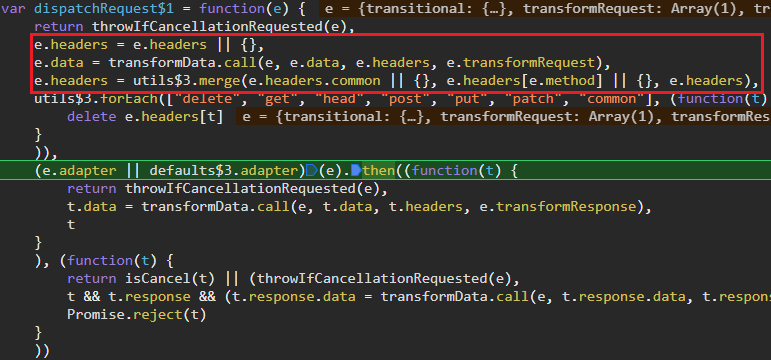

到这里可以看到已经开始组装请求包了，再往上回溯，此时调用的是`Axios$1.request`，用过axios的应该知道这是个请求拦截器

这里别分遍历request和response拦截器定义的函数，放入n和i（这里的this是`axiosInstance`，后面调试可知）

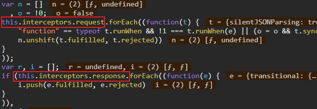

这里的e就含有原始的数据


n和i各有两个拦截函数，最后拼接到s得到`s = [n, dispatcherRequest, void 0, i]`

循环条件为`s.length`，每次循环都会执行两次`s.shift`，即每次循环长度减2，请求前拦截 + 发送请求 + 响应后拦截，三次循环刚好

每次循环都进行异步调用，这里简单介绍一下JS的异步执行

> 在JavaScript中，Promise是一种用于处理异步操作的对象。它代表了一个可能尚未完成、但最终会完成并返回结果的操作。Promise对象可以用于处理诸如网络请求、文件读取、数据库查询等需要等待的操作。
>
> 当一个Promise对象被创建时，它处于Pending状态。一旦操作完成，它可以变为Fulfilled状态，如果出现错误，则变为Rejected状态。在Promise对象的生命周期中，状态不可逆。
>
> Promise对象提供了一些方法来处理异步操作的结果。其中最重要的方法是`then()`和`catch()`。
>
> `then(onFulfilled, onRejected)`方法用于指定当Promise对象变为Fulfilled或Rejected状态时要执行的回调函数。`onFulfilled`回调函数在Promise对象变为Fulfilled状态时调用，接收操作的结果作为参数。`onRejected`回调函数在Promise对象变为Rejected状态时调用，接收错误信息作为参数。
>
> `catch(onRejected)`方法用于指定当Promise对象变为Rejected状态时要执行的回调函数。

让我们进入第一次循环

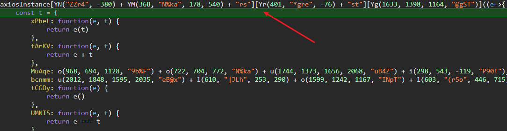

放控制台打印，得到`axiosInstance.interceptors.request.use`，直接跳到函数的最后一行返回处，发现此时请求体已经加密了，再往上看吧

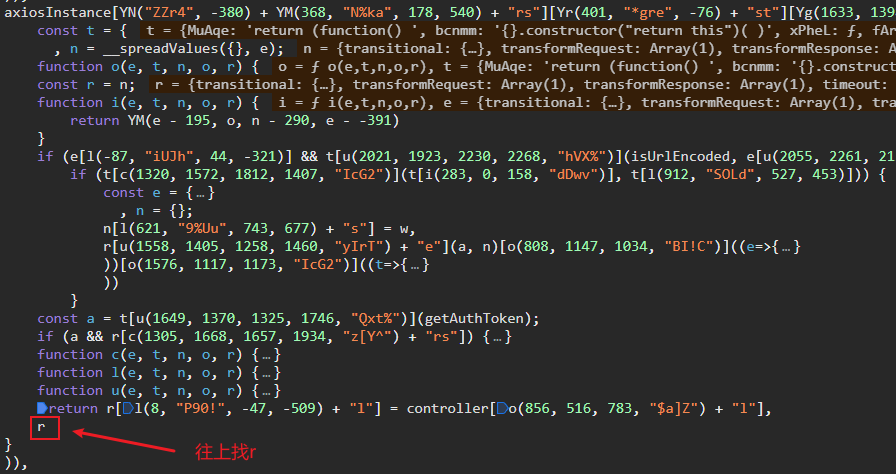

找到了修改`r['data']`的地方，接下来就是扣代码了。

遇到了一个问题，有一段代码是在VM中执行了，这里的Writer

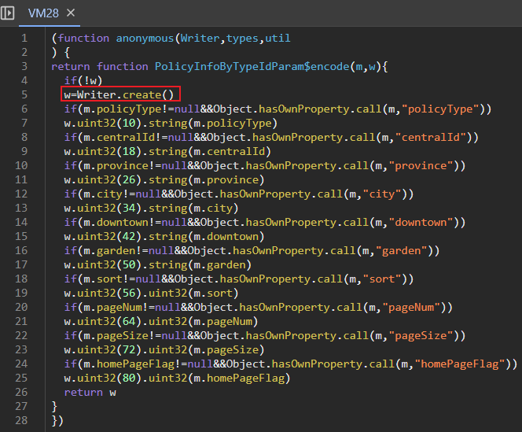

Writer跳转后却是一个名为d构造函数，后面也定义了一些VM中后面用到的函数

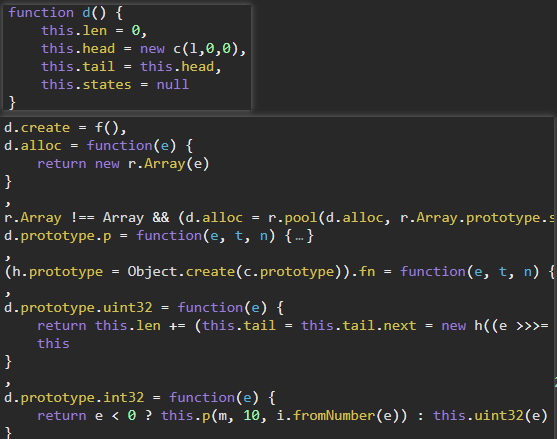

盲猜是webpack的模块化处理

全文搜索`Writer`，找到一处`o.Writer = e(38)`，往上找e，发现一大堆 `x: []`，都被放在r这个对象

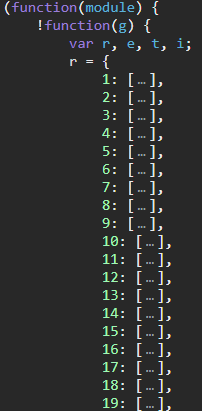

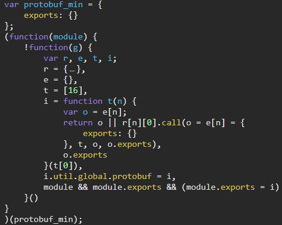

符合webpack的特征了，加载器为i

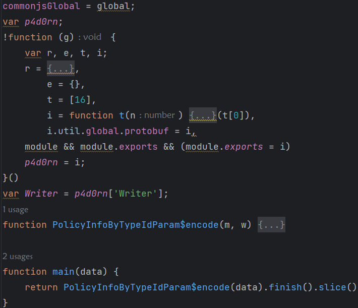

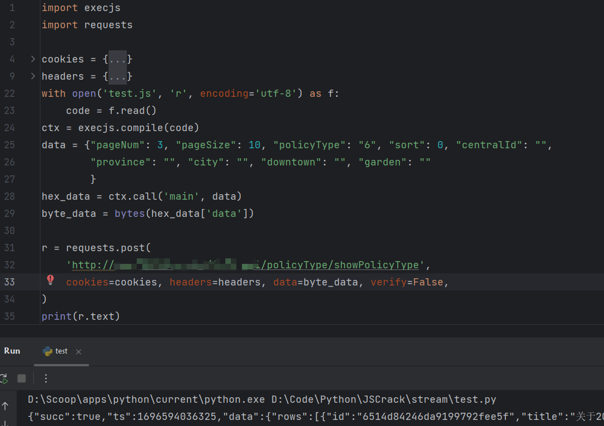

