# WebPack Intro

WebPack是一个基于模块化的打包工具，可以把开发中所有的资源（图片、js文件、css文件等）都看成模块，通过loader（加载器）和plugins（插件）对资源进行处理，打包成符合生产环境部署的前端资源，所有的资源都是由js渲染出来的

若一个页面大部分是`script`标签构成，大概率是`webpack`打包

# Best Pratice

## Extract Snippet

🎯Target：dWdnY2Y6Ly9ycC56dmF6cmdueWYucGJ6LnBhL2JjcmEvdWJ6ci9jaGVwdW5mci12YXNi

采购信息分页处，每次点击下一页都会发送两个包

第二个返回包中含有数据

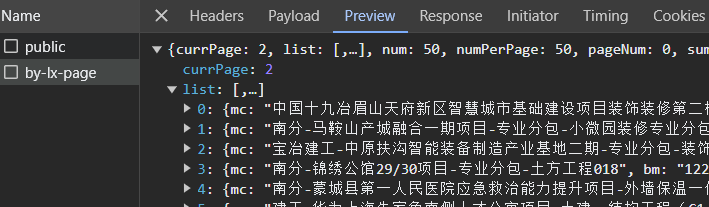

但第二个请求包的请求体是密文

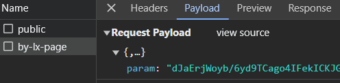

第一个请求包public，盲猜是请求公钥，然后用公钥去加密第二个请求包的参数

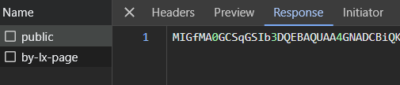

全局搜索第一个请求包的请求路径：`open/homepage/public`

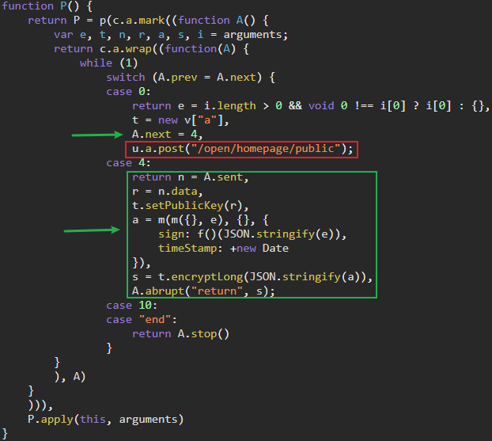

一眼switch控制流平坦化，调试可知：

`t.setPublicKey(r)`的r即第一个请求包获取到的公钥

`t.encryptLong(JSON.stringify(a))`的a即真实的请求参数JSON

这里的t是个大头，看样子是个加密类，`t = new v["a"]`，往上找`v`

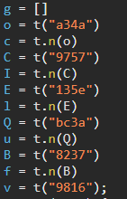

v这个全局变量是从`t("9816")`获取的，这里的t就是webpack的加载器

一大堆x(“yyy”)也是webpack的特征

全局搜`9816`，扣下来

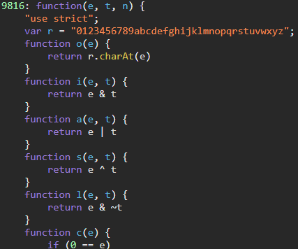

再把webpack的入口代码也扣下来，格式就是一个自执行函数，参数为({xxx:function(){...}})或([function(){...}...])

即参数可能为对象或数组

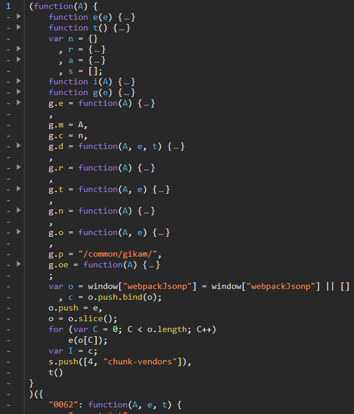

这里的g就是加载器，我们在外部定义一个变量，自执行函数最后给这个变量赋值g

尝试打印9816这个方法，报错了

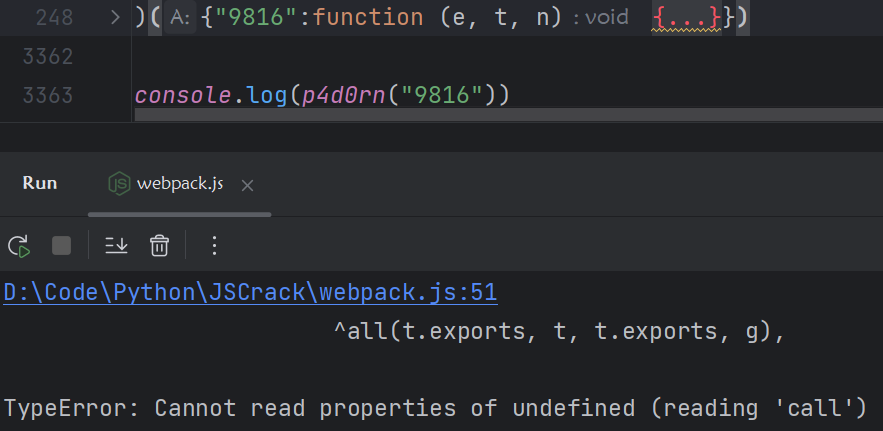

说明这个9816模块还依赖其他模块

在`v = t("9816");`处下断点，刷新后再到`return A[e].call(t.exports, t, t.exports, g)`处下断点

执行了两次，第一次e为`9816`，第二次为`a524`

或者直接在源码`return A[e].call(t.exports, t, t.exports, g)`前面打印e

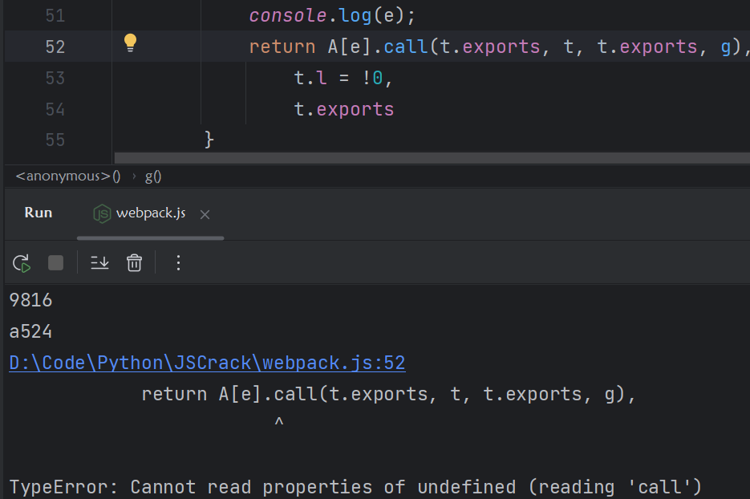

再去扣`a524`的代码即可

目前状况下运行，报错m找不到

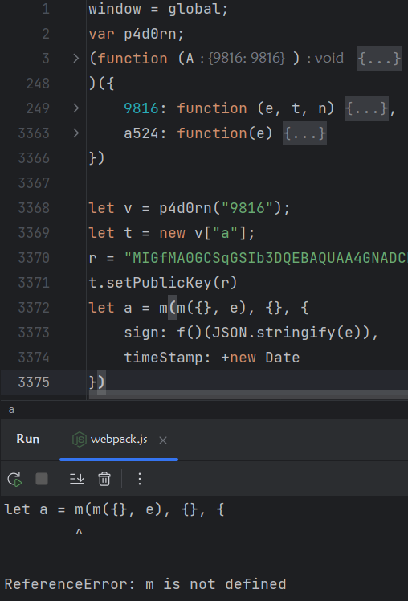

继续扣，接着e报错找不到

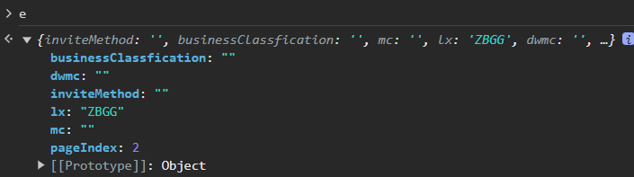

e中存有页码信息，接着又补了两个函数b和d

然后是`sign: f()(JSON.stringify(e))`，找不到f函数，调试跟进f

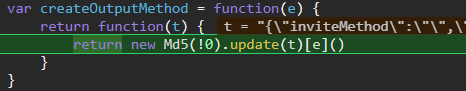

MD5算法，可能是标准的也可能是魔改的

与在线md5对比一下，结果一致，直接用`crypto-js`

封装一下：

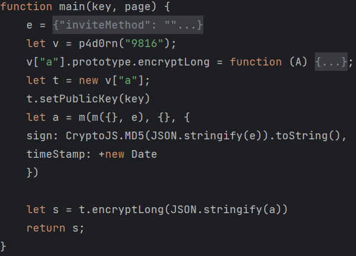

成功！

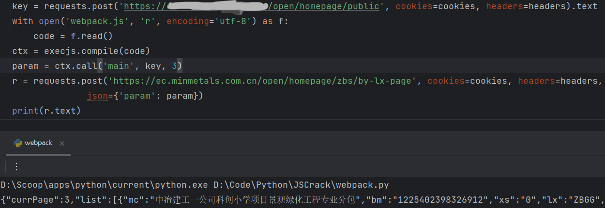

## Extract All

上面一个模块的依赖模块只有一个，可以手动扣，若依赖模块有好几十个，一个嵌套一个，那就很麻烦了。

这时候就要把所有模块都扣下来

🎯Target：dWdnY2Y6Ly9qamoueG5hbXVoYS5wYnovc3Zlei9lcnBlaHZnLzFVSTUydH5+LnVnenk/eG49cGJ6LWVycGVodmctemJxaHlyLXJrY2Jmcg==

求职招聘的接口参数被加密

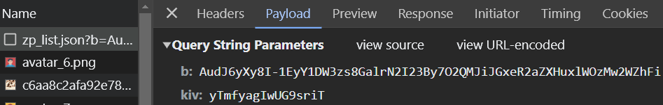

全局搜索kiv

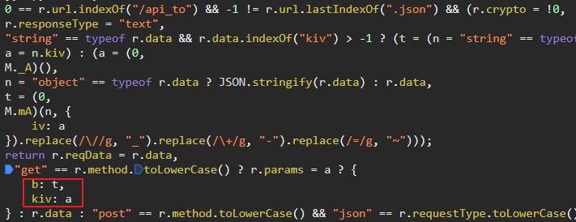

```js
a = M._A()
t = M.mA(r.data, {iv: a}).replace(/\//g, "_").replace(/\+/g, "-").replace(/=/g, "~");
```

往上找M，又是通过加载器获取的

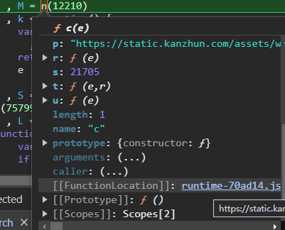

但这个加载器比较特殊，它没有传入模块参数

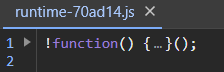

实际上里面还有个自执行函数，加载了其他文件的模块

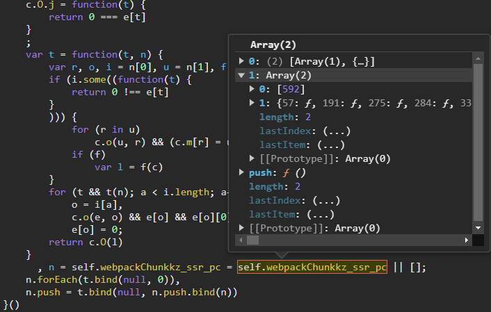

把这里的`self`换成`window`，再在外部定义`window = global`

加载器扣好了，接下来就要去扣其他模块了，全局搜`12210: `

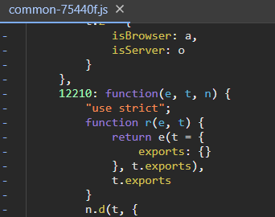

把整个文件制下来到`./module2`，同时把开头的`self.webpackChunkkz_ssr_pc = self.webpackChunkkz_ssr_pc`

修改`self`为`window`

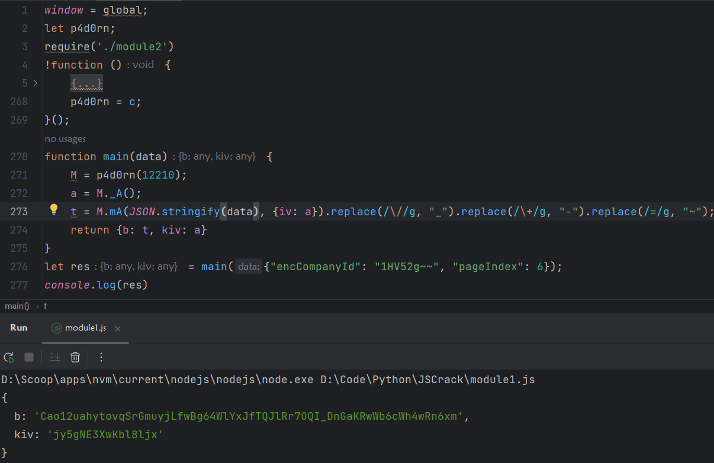

到此完成请求包加密的模拟，顺便把返回包也解密了。

依旧是配合调用栈+搜索`JSON.parse`

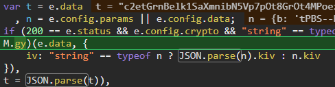

这里`e.data`即返回的密文，接着取出上面的请求参数kiv作为偏移值iv，跟进`M.gy`可以发现是AES加密


不过既然我们都扣下来了，就直接调js吧。

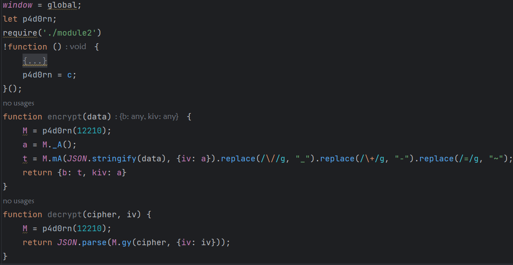

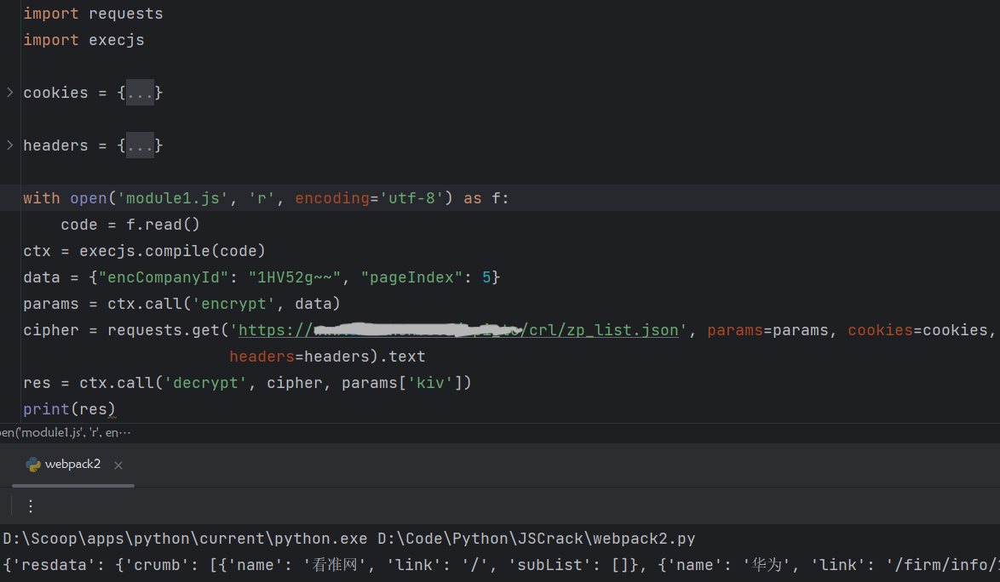