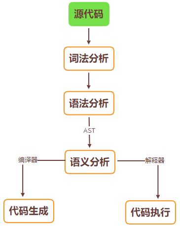
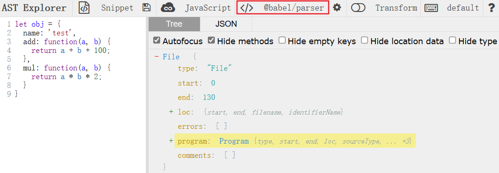
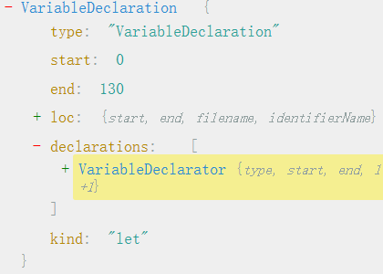
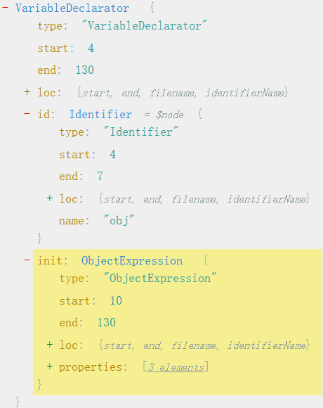
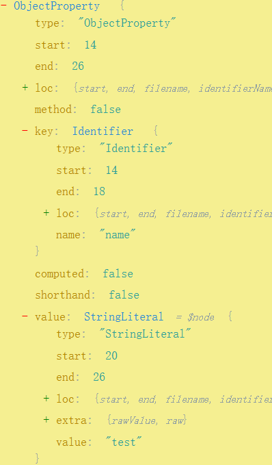
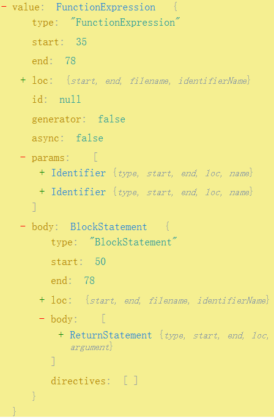
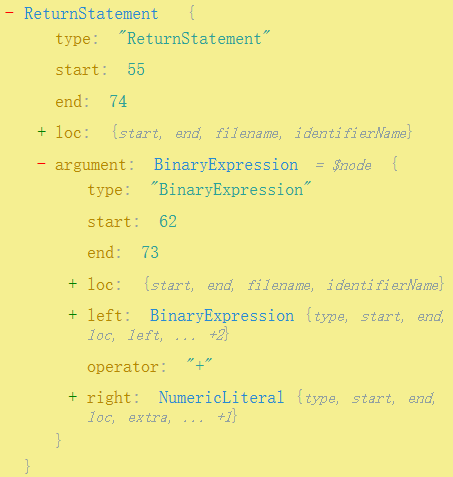

> Laughter is poison to fear.

# Theory and Implementation of Abstract Syntax Tree

## 0x01 compilation and AST

将原本联系紧密、结构紧凑的源代码切分为不可再分的词块，以多叉树的形式表现出来。

编译器分为五个部分：词法分析、语法分析、语义分析、中间代码的生成及优化、目标代码的生成。

从JS源代码到ASR抽象语法树主要有两步：

* 将源代码进行词法分析，生成token符号流
* token符号流通过语法分析，生成语法树



## 0x02 Lexical Analysis

词法分析是将源代码转化为AST抽象语法树的第一步，是编译的基础。

词法分析器会对源代码进行扫描，按照定义的词法规则识别单词，并生成对应的单元供语法分析器调用。

如下面一行代码

```js
let x = y + 1;
```

| 类型序号 | 单词类型   | 语素 | 名称        |
| -------- | ---------- | ---- | ----------- |
| 0        | 关键词     | let  | LET         |
| 1        | 赋值操作符 | =    | ASSIGN_SIGN |
| 2        | 变量       | x    | IDENTIFIER  |
| 3        | 加法操作符 | +    | PLUS_SIGN   |
| 4        | 数字       | 1    | INTEGER     |
| 5        | 语句结束   | ;    | SEMICOLON   |

语素是一类字符构成的单元，词法分析器还会为每个语素添加属性，并带上语素对应的行号，如下所示

> LET(0, 'let',1)
>
> IDENTIFIER(2,'x',1)
>
> ASSIGN_SIGN(1,'=',1)
>
> IDENTIFIER(2,'y',1)
>
> PLUS_SIGN(3,'+',1)
>
> INTEGER(4,'1',1)
>
> SEMICOLON(5,';',1)

将输入的代码分隔为单词，进而将单词进行分类的过程叫做单词化，生成的代词用于进行语法分析。

下面用Python实现一个简易的词法分析器

`Token`类：

```python
class Token:
    def __init__(self, _type, literal, line_no):
        self._type = _type
        self.literal = literal
        self.lineNo = line_no

    def __str__(self):
        return f"Type: {self._type}\tLiteral: {self.literal:4}\tLineNumber: {self.lineNo}"
```

`Lexer`类：

```python
class Lexer:
    def __init__(self, code):
        self.code = code
        self.read_pos = 0
        self.line_count = 1
        self.char = ''
        self.ini_token_type()

    def ini_token_type(self):
        self.ILLEGAL = -2
        self.EOF = -1
        self.LET = 0
        self.IDENTIFIER = 1
        self.ASSIGN_SIGN = 2
        self.PLUS_SIGN = 3
        self.INTEGER = 4
        self.SEMICOLON = 5

    def read_char(self):
        if self.read_pos >= len(self.code):
            self.char = 0  # end of file
        else:
            self.char = self.code[self.read_pos]
        self.read_pos += 1

    def skip(self):  # skip the blank space
        while self.char == ' ' or self.char == '\t' or self.char == '\n':
            if self.char == '\n':
                self.line_count += 1   # line + 1
            self.read_char()

    def next_token(self):
        self.skip()
        match self.char:
            case '+':
                token = Token(self.PLUS_SIGN, '+', self.line_count)
            case '=':
                token = Token(self.ASSIGN_SIGN, '=', self.line_count)
            case ';':
                token = Token(self.SEMICOLON, ';', self.line_count)
            case 0:
                token = Token(self.EOF, '', self.line_count)
            case _:
                if _str := self.read_identifier():
                    if _str == 'let':
                        token = Token(self.LET, 'let', self.line_count)
                    else:
                        token = Token(self.IDENTIFIER, _str, self.line_count)
                elif _str := self.read_integer():
                    token = Token(self.INTEGER, _str, self.line_count)
                else:
                    token = Token(self.ILLEGAL, '', self.line_count)
                    self.read_char()
                return token
        self.read_char()
        return token

    def read_identifier(self):
        identifier = ''
        while self.char.isalpha():  # 简单判断字母构成的单词为变量，当然变量也可以包含其他字符
            identifier += self.char
            self.read_char()
        if len(identifier) > 0:
            return identifier
        return False

    def read_integer(self):
        integer = ''
        while self.char.isdigit():
            integer += self.char
            self.read_char()

        if len(integer) > 0:
            return integer
        return False

    def start_lex(self):
        self.read_char()
        token = self.next_token()
        while token._type != self.EOF:
            print('token: ', token)
            self.tokens.append(token)
            token = self.next_token()
        self.tokens.append(token)
```

测试：

```python
codes = """
let test = 2 + 3;
let a = test + 5;
"""
lexer = Lexer(codes)
lexer.start_lex()
```

> token:  Type: 0	Literal: let 	LineNumber: 2
>
> token:  Type: 1	Literal: test	LineNumber: 2
>
> token:  Type: 2	Literal: =   	LineNumber: 2
>
> token:  Type: 4	Literal: 2   	LineNumber: 2
>
> token:  Type: 3	Literal: +   	LineNumber: 2
>
> token:  Type: 4	Literal: 3   	LineNumber: 2
>
> token:  Type: 5	Literal: ;   	LineNumber: 2
>
> token:  Type: 0	Literal: let 	LineNumber: 3
>
> token:  Type: 1	Literal: a   	LineNumber: 3
>
> token:  Type: 2	Literal: =   	LineNumber: 3
>
> token:  Type: 1	Literal: test	LineNumber: 3
>
> token:  Type: 3	Literal: +   	LineNumber: 3
>
> token:  Type: 4	Literal: 5   	LineNumber: 3
>
> token:  Type: 5	Literal: ;   	LineNumber: 3

## 0x03 Syntactic Analysis

语法分析器会接收词法分析器给出的词块，在此基础上将词块组成的各类语法短语，分析是否是给定语法的正确句子

如下语句

```js
let test = 1;
```

经过词法分析器的切分会转化为如下形式

```js
LET IDENTIFIER ASSIGN_SIGN INTEGER SEMICOLON
```

为进行语法判断，需要严格定义每一行代码背后的逻辑结构。如一个let语句的语法表达式如下

```js
LetStatement: LET IDENTIFIER ASSIGN_SIGN INTEGER SEMICOLON
```

方便起见这里规定赋值符号后面只能是整型，当然也可以换成EXPRESSION

```js
let test 123;
```

上面代码在词法分析后得到如下结果

```js
LET IDENTIFIER INTEGER SEMICOLON
```

显然与规定的语法表达式不符合，这时语法分析器就报告错误

下面用Python简单实现一个语法分析器

```python
import json

from lexical_analyser import Lexer


class LetStatement:
    def __init__(self, props):
        res = {'LetStatement': {}}
        res['LetStatement'].update({'left': props['identifier']['value']})
        res['LetStatement'].update({'right': props['expression']['value']})
        self.res = res

    def __str__(self):
        return json.dumps(self.res)


class CompilerParser:
    def __init__(self, lexer: Lexer):
        self.lexer = lexer
        self.lexer.start_lex()
        self.token_pos = 0
        self.current_token = None  #  当前Token
        self.next_token = None  # 下一个Token
        self.next()
        self.next()

    def next(self):
        self.current_token = self.next_token
        if self.token_pos < len(self.lexer.tokens):
            self.next_token = self.lexer.tokens[self.token_pos]
        self.token_pos += 1

    def parse_program(self):
        res = []
        while self.current_token._type != self.lexer.EOF:
            if statement:= self.parse_statement()
                res.append(statement)
            else:
                self.next()
        return res

    def parse_statement(self):
        # 目前只实现了let语句的解析
        if self.current_token._type == self.lexer.LET:
            return self.parse_let()
        else:
            return None

    def parse_let(self):
        # 判断是否符合表达式 LET IDENTIFIER ASSIGN_SIGN INTEGER SEMICOLON
        props = {}
        props['token'] = self.current_token
        if self.next_token._type == self.lexer.IDENTIFIER:
            self.next()
        else:
            return None
        ident_props = {}
        ident_props['token'] = self.current_token
        ident_props['value'] = self.current_token.literal
        props['identifier'] = ident_props
        if self.next_token._type == self.lexer.ASSIGN_SIGN:
            self.next()
        else:
            return None
        if self.next_token._type == self.lexer.INTEGER:  # 只允许赋值操作符后面跟整数
            self.next()
        else:
            return None
        expr_props = {}
        expr_props['token'] = self.current_token
        expr_props['value'] = self.current_token.literal
        props['expression'] = expr_props

        if self.next_token._type == self.lexer.SEMICOLON:
            self.next()
        else:
            return None
        return LetStatement(props)

    def start_parse(self):
        for i in self.parse_program():
            print(i)
```

测试：

```python
from lexical_analyser import Lexer
from syntactic_analyser import CompilerParser

codes = """
let test = 2;
let a = 5;
"""
lexer = Lexer(codes)
parser = CompilerParser(lexer)
parser.start_parse()
```

## 0x04 Babel compilation 

在线AST解析👉[AST explorer](https://astexplorer.net/), 选择`@babel/parser`




最外层是类型为`Program`，`body`字段为整个程序



整个程序只有一个变量声明语句，因此`body`数组只有一个元素

* `type`: `VariableDeclaration`
* `kind`: 变量声明类型为`let`
* `declarations`: 声明数组，只有一个元素为`VariableDeclarator`，若代码为`let a=1,b=2`则此处数组有两个元素



* `id`: `type`为`Identifier`，`name`为变量名
* `init`: 初始化的内容，这里为`ObjectExpression`即对象表达式，若没有对变量进行初始化则`init`为`null`. `properties`为数组，有三个元素表示该对象有三个成员



* `type`: `ObjectProperty`对象成员
* `key`: `Identifier`, `name`为键名
* `value`: `StringLiteral`字符串常量，`value`为键值

obj还有两个函数成员，其`value`为`FunctionExpression`



* `params`: 方法参数，`type`为`Identifier`
* `body`: 方法体, `type`为`BlockStatement`，`body`下面还有`body`数组，方法体内只有一句返回语句，所以数组只有一个元素`ReturnStatement`



* `argument`: 返回的参数
  * `type`：`BinaryExpression`二元表达式, 可以表示为`left operator right`
  * `left`: `BinaryExpression` (a+b)
  * `operator`: 操作符(+)
  * `right`: `NumericLiteral` 数值字面量(100)


