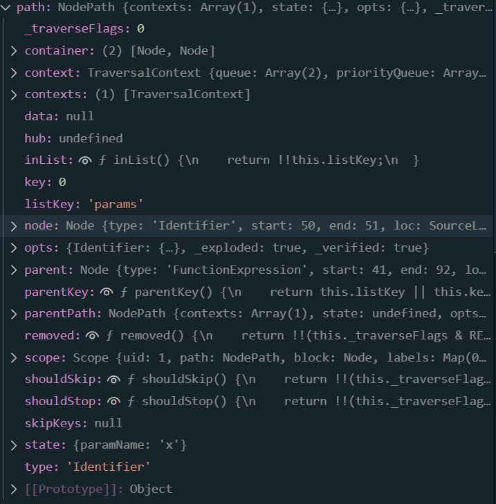
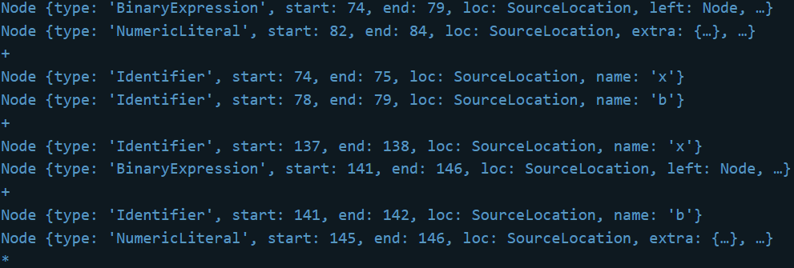
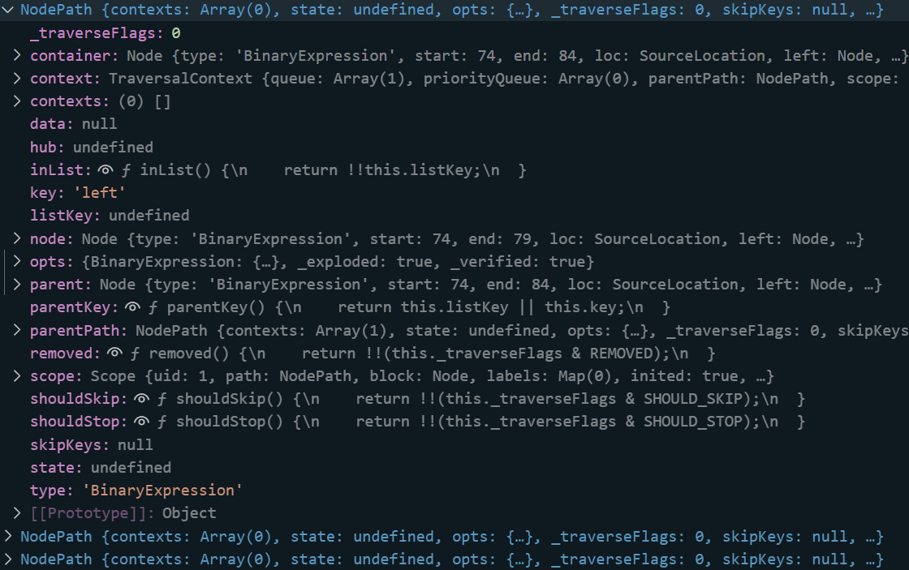
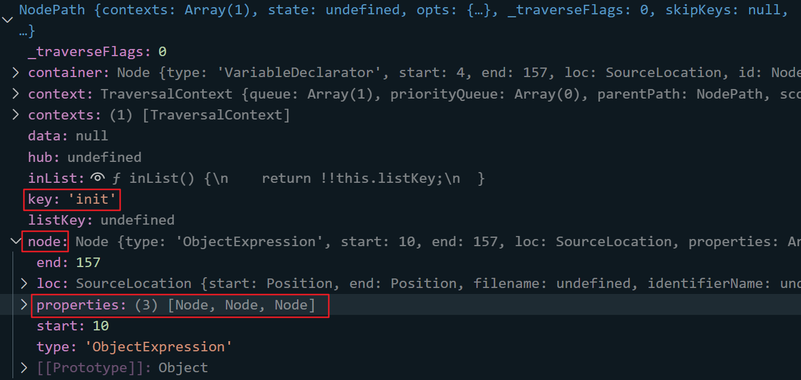
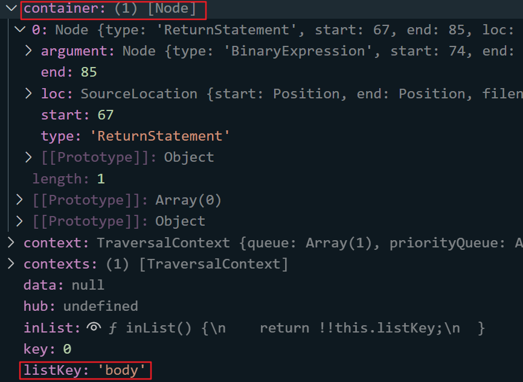
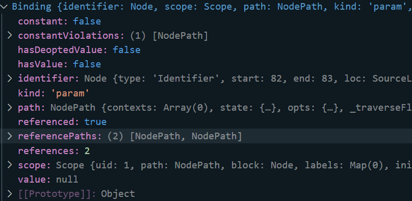
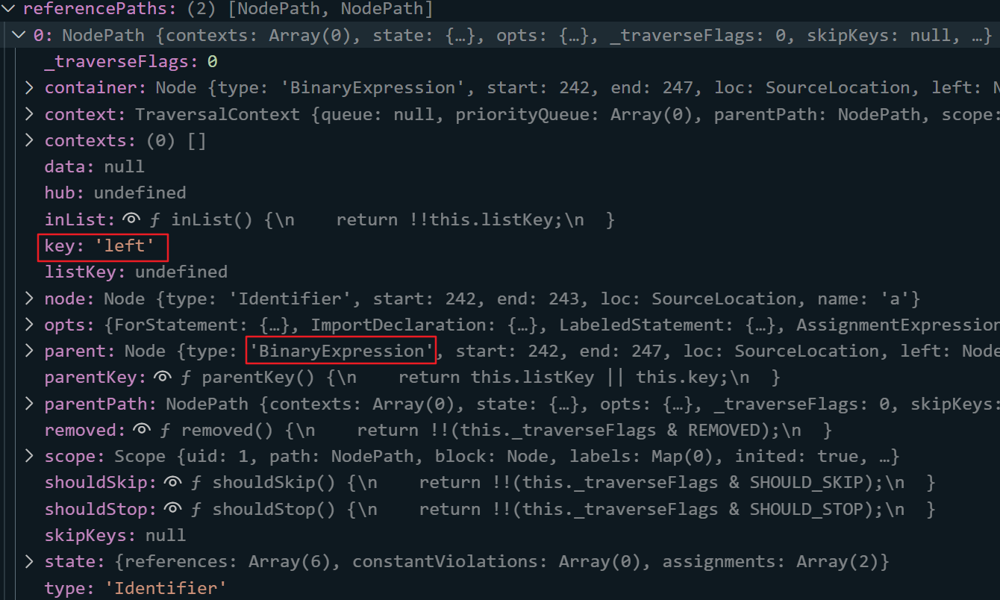
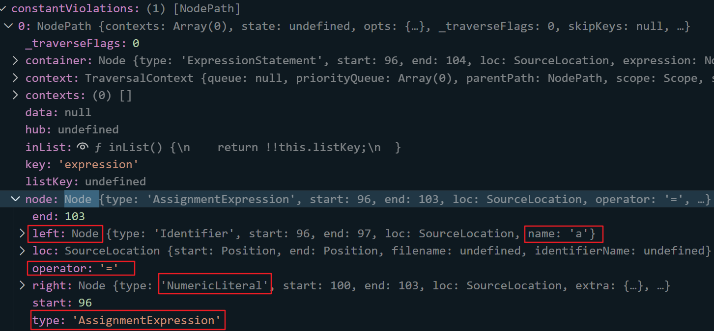

> Nothing someone says before the word “but” really counts.

## 0x01 Babel Intro

上一节使用Python实现了一个简易的解析器，了解了源代码到AST的转换过程。但若从头开始实现一个编译器是十分复杂的。

Babel 是一个工具链，主要用于在当前和旧的浏览器或环境中，将 ECMAScript 2015+ 代码转换为 JavaScript 向后兼容版本的代码。它能做下面的事情：

* 转换语法
* 源代码转换
* polyfill目标环境缺少的功能

Babel编译过程主要有以下三个阶段

* 解析(Parse)：将输入字符流解析为AST抽象语法树

* 转化(Transform)：对抽象语法树进一步转化

  接收AST并对其进行遍历，在此过程中对节点进行添加、更新、移除等操作，后续的混淆JS代码以及混淆过的JS代码进行还原都在此处。

* 生成(Generate)：根据转化后的语法树生成目标代码

> 之所以把源码转化为抽象语法树，是因为树状结构更加容易进行原子操作，可以对任意的节点进行精细化处理。抽象语法树中，代码间的关系被抽象为节点间的关系，实现相同功能的节点之间的表示也相同。因此我们不需要关心具体的代码，只要指定几条规则就行

源代码：

```js
let obj = {
    name: 'test',
    add: function(a, b) {
        return a + b + 10;
    },
    mul: function(a, b) {
        return a + b * 2;
    }
}
```

使用Babel生成AST并进行转换

```js
const fs = require('fs')
const parser = require('@babel/parser')
const traverse = require('@babel/traverse').default
const t = require('@babel/types')
const generator = require('@babel/generator').default
const jscode = fs.readFileSync('./src.js', {
    encoding: 'utf-8'
})
let ast = parser.parse(jscode) // 生成AST
let ast_json = JSON.stringify(ast, null, 2)  
fs.writeFileSync('./ast.json', ast_json, err => {})
let code = generator(ast).code  // 转换为新代码
fs.writeFileSync('./newSrc.js', code, err => {})
```

Babel有很多组件和API

* `@babel/parser`: 将JS代码转换为AST
* `@babel/travers`: 遍历AST节点
* `@babel/types`: 判断节点类型、生成新节点
* `@babel/generator`: 把AST转化为JS代码

Babel处理JS文件的流程

* 读取JS文件
* 解析成AST
* 对AST节点进行增删改查
* 生成新的JS代码并保存

## 0x02 parser|generator

`parser`: JS转AST

`generator`: AST转JS

```js
let ast = parser.parse(jscode, {sourceType: 'module'})
```

* `parser.parse`返回一个对象，可以使用`JSON.stringify`将其转化为JSON字符串
* 第二个参数是一个对象，`sourceType`默认为`script`，当解析的JS代码中含有`import`、`export`等关键字时，需要指定`sourceType`为`module`

```js
let code = generator(ast, {
    retainLines: false, 
    comments: false, 
    compact: true
}).code
```

* `generator`返回的一个对象，其`code`属性才是需要的代码
* `retainLines`: 是否使用与源代码相同的行号，默认`false`，输出的是格式化后的代码
* `comments`: 是否保留注释，默认`true`
* `compact`: 是否压缩代码

## 0x03 traverse|visitor

`traverse`用于遍历节点，配合`visitor`进行节点过滤

```js
let visitor = {};
visitor.FunctionExpression = function(path){
	console.log("visit FunctionExpression");
};
traverse(ast, visitor);
```

打印了两次`visit FunctionExpression`

`visitor`中方法的参数path对应`Path`对象而非节点对象`Node`

`visitor`的定义一般有如下三种方式：

```js
const visitor1 = {
    FunctionExpression: function(path) {
        console.log("visit FunctionExpression");
    }
};

const visitor2 = {
    FunctionExpression(path) {
        console.log("visit FunctionExpression");
    }
};

const visitor3 = {
    FunctionExpression: {
        enter(path) {
            console.log("enter FunctionExpression");
        },
        exit(path) {
            console.log("exit FunctionExpression");
        }
    }
};
```

在遍历节点的过程中，有两次机会访问一个节点，分别是进入节点(enter)和退出节点(exit)

可以把同一个函数应用到多个节点，`|`连接方法名

```js
const visitor = {
    "FunctionExpression|BinaryExpression"(path){
        console.log("expression");
    }
};
```

也可以把多个函数应用于同一个节点

```js
function func1(path){
	console.log('func1');
}
function func2(path){
	console.log('func2');
}

const visitor = {
    FunctionExpression: {
        enter: [func1, func2]
    }
};
```

当遍历到某个节点时，我们可以定义新的visitor对其下的子树进行特殊的处理，如下面代码的功能为替换所有函数的第一个参数为x

```js
const updateParamNameVisitor = {
    Identifier(path) {
        if(path.node.name === this.paramName) {
            path.node.name = "x";
        }
    }
};
const visitor = {
    FunctionExpression(path) {
        const paramName = path.node.params[0].name;
        path.traverse(updateParamNameVisitor, {paramName});
    }
};

traverse(ast, visitor);
```

先根据`visitor`去`traverse`所有节点，当遍历到`FunctionExpression`节点时，再用`updateParamNameVisitor`去遍历当前节点下的所有子节点。使用`path.traverse`时还可以额外传入一个对象，在对应的`visitor`中可以用`this`去引用。

## 0x04 types

用于判断节点类型、生成新的节点

下面两种写法等价，用于把所有变量名x改成n

```js
traverse(ast, {
	enter(path) {
		if (
			path.node.type === "Identifier" &&
			path.node.name === "x"
		){
			path.node.name = "n";
		}
	}
});

traverse(ast, {
	enter(path) {
		if (
			t.isIdentifier(path.node, {name: 'x'})
		){
			path.node.name = "n";
		}
	}
});
```

下面用`types`来生成我们最早的代码

由上一节的AST在线解析的分析，首先要生成一个`variableDeclaration`，`kind`参数是声明类型，`declarations`是一个`VariableDeclarator`数组

```typescript
declare function variableDeclaration(kind: "var" | "let" | "const" | "using" | "await using", declarations: Array<VariableDeclarator>): VariableDeclaration;
```

`id`为`Identifier`, `init`后面跟着`?`表示可选参数，`init`表示是否在变量声明时初始化变量，这里需要一个`ObjectExpression`

```typescript
declare function variableDeclarator(id: LVal, init?: Expression | null): VariableDeclarator;
```

对象可以有多个属性，因此`properties`是个数组，我们需要三个`ObjectProperty`

```js
declare function objectExpression(properties: Array<ObjectMethod | ObjectProperty | SpreadElement>): ObjectExpression;
```

```typescript
declare function objectProperty(key: Expression | Identifier | StringLiteral | NumericLiteral | BigIntLiteral | DecimalLiteral | PrivateName, value: Expression | PatternLike, computed?: boolean, shorthand?: boolean, decorators?: Array<Decorator> | null): ObjectProperty;
```

第一个属性值是`StringLiteral`

```typescript
declare function stringLiteral(value: string): StringLiteral;
```

第二、三个属性值是`FunctionExpression`

```typescript
declare function functionExpression(id: Identifier | null | undefined, params: Array<Identifier | Pattern | RestElement>, body: BlockStatement, generator?: boolean, async?: boolean): FunctionExpression;
```

* `id`: 函数名 `Identifier`
* `params`: 参数数组
* `body`: 函数体 `BlockStatement`

```typescript
declare function blockStatement(body: Array<Statement>, directives?: Array<Directive>): BlockStatement;
```

`body`为`Statement`数组，我们的函数体内只有返回语句

```typescript
declare function returnStatement(argument?: Expression | null): ReturnStatement;
```

返回语句由二元表达式构成

```typescript
declare function binaryExpression(operator: "+" | "-" | "/" | "%" | "*" | "**" | "&" | "|" | ">>" | ">>>" | "<<" | "^" | "==" | "===" | "!=" | "!==" | "in" | "instanceof" | ">" | "<" | ">=" | "<=" | "|>", left: Expression | PrivateName, right: Expression): BinaryExpression;
```

完整代码：

```js
const fs = require('fs');
const t = require("@babel/types");
const generator = require("@babel/generator").default;

let a = t.identifier('a')
let b = t.identifier('b')

let binExpr2 = t.binaryExpression('+', a, b);
let binExpr3 = t.binaryExpression('*', a, b);

let retSta2 = t.returnStatement(t.binaryExpression('+', binExpr2, t.numericLiteral(100)));
let retSta3 = t.returnStatement(t.binaryExpression('*', binExpr3, t.numericLiteral(2)));

let blockSta2 = t.blockStatement([retSta2]);
let blockSta3 = t.blockStatement([retSta3]);

let funcExpr2 = t.functionExpression(null, [a,b], blockSta2);
let funcExpr3 = t.functionExpression(null, [a,b], blockSta3);

let objProp1 = t.objectProperty(t.identifier('name'), t.stringLiteral('test'));
let objProp2 = t.objectProperty(t.identifier('add'), funcExpr2);
let objProp3 = t.objectProperty(t.identifier('mul'), funcExpr3);
let objExpr = t.objectExpression([objProp1, objProp2, objProp3])
let varDec = t.variableDeclarator(t.identifier('obj'), objExpr);
let newNode = t.variableDeclaration('let', [varDec])
let code = generator(newNode).code

fs.writeFileSync('./localNewSrc.js', code, err => {})
```

生成的代码：

```js
let obj = {
  name: "test",
  add: function (a, b) {
    return a + b + 100;
  },
  mul: function (a, b) {
    return a * b * 2;
  }
};
```

上面用到了`StringLiteral`和`NumericLiteral`， Babel 中还定义了一些其他的字面量

```typescript
export function nullLiteral(): NullLiteral;
export function booleanLiteral(value: boolean): BooleanLiteral;
export function regExpLiteral(pattern: string, flags?: any): RegExpLiteral;
```

当生成比较多的字面量时，会比较麻烦，所以Babel还提供了`valueToNod`

```typescript
export function valueToNode(value: undefined): Identifier
export function valueToNode(value: boolean): BooleanLiteral
export function valueToNode(value: null): NullLiteral
export function valueToNode(value: string): StringLiteral
export function valueToNode(value: number): NumericLiteral | BinaryExpression | UnaryExpression
export function valueToNode(value: RegExp): RegExpLiteral
export function valueToNode(value: ReadonlyArray<undefined | boolean | null | string | number | RegExp | object>): ArrayExpression
export function valueToNode(value: object): ObjectExpression
export function valueToNode(value: undefined | boolean | null | string | number | RegExp | object): Expression
```

```js
let loaclAst = t.valueToNode([1, "2", false, null, undefined, /w\s/g, { x: '1000', y: 2000 }]);
let code = generator(loaclAst).code;
console.log(code);
```

## 0x05 Path

`Node`对象包含在`Path`对象中，下面会介绍`Path`对象的属性及方法



### Path Methods

* 获取Node/Path

为获取节点的属性值，一般先访问到该节点，再直接点访问(`.`)属性

```js
const visitor = {
    BinaryExpression(path) {
        console.log(path.node.left);
        console.log(path.node.right);
        console.log(path.node.operator);
    }
};
```



但这种方法获取的是Node或具体属性值，无法使用Path类的方法

```js
const visitor = {
    BinaryExpression(path) {
        console.log(path.get('left'));
        console.log(path.get('right'));
        console.log(path.get('operator'));
    }
};
```



`path.get`支持多级访问，如`path.get('left.type')`

得到的是封装的`NodePath`对象，就可以使用`Path`相关方法

* 判断Path类型

上面的types组件可以用来判断`Node`的类型

```js
t.isIdentifier(path.node)
t.isIdentifier(path.node, {name: 'x'})
```

`Path`也提供了判断自身类型的方法

```js
const visitor = {
    BinaryExpression(path) {
        console.log(path.get('left').isIdentifier());  // false
        console.log(path.get('right').isNumericLiteral({value: 10}));  // true
        console.log(path.get('left').assertIdentifier());  // 报错
    }
};
```

* 节点转代码

很多时间需要在执行过程中把部分节点转为代码，而非在最后才把整个AST转成代码，`generator`组件可以做到

```js
const visitor = {
    FunctionExpression(path) {
        console.log(generator(path.node).code);
    }
};
// function (x, b) {
//     return x + b + 10;
// }
// function (x, b) {
//     return x + b * 2;
// }
```

`Path`对象重写了`Object`的`toString`，其中调用了`generator`组件把节点转为代码，因此可以直接`path.toString()`来把节点转为代码，或者`path + ''`隐式转换

```js
const visitor = {
    FunctionExpression(path) {
        console.log(path.toString());
        // console.log(path + '');
    }
};
```

* 替换节点属性

获取节点属性直接赋值即可

```js
const visitor = {
    BinaryExpression(path) {
        path.node.left = t.identifier('x');
        path.node.right = t.identifier('y')
    }
};
```

```js
let obj = {
  name: 'test',
  add: function (x, b) {
    return x + y;
  },
  mul: function (x, b) {
    return x + y;
  }
};
```

* 替换整个节点

`replaceWith`：一换一

```js
const visitor = {
    BinaryExpression(path) {
        path.replaceWith(t.valueToNode('hhh'));
    }
};
```

```js
let obj = {
  name: 'test',
  add: function (x, b) {
    return "hhh";
  },
  mul: function (x, b) {
    return "hhh";
  }
};
```

`replaceWithMultiple`：多换一

```js
const visitor = {
    ReturnStatement(path) {
        path.replaceWithMultiple([
            t.variableDeclaration('let', [t.variableDeclarator(t.identifier('res'), t.numericLiteral(20))]),
            t.returnStatement(t.identifier('res')),
        ]);
        path.stop();
    }
};
```

```js
let obj = {
  name: 'test',
  add: function (x, b) {
    let res = 20;
    return res;
  },
  mul: function (x, b) {
    return x + b * 2;
  }
};
```

`replaceInline`：接收一个参数，若该参数不为数组，等价于`replaceWith`；若该参数为数组，等价于`replaceWithMultiple`

`replaceWithSourceString`：用字符串源码替换节点

```js
const visitor = {
    ReturnStatement(path) {
        let argumentPath = path.get('argument');
        argumentPath.replaceWithSourceString(`function(){return ${argumentPath} }()`);
        path.stop();
    }
};
```

```js
let obj = {
  name: 'test',
  add: function (x, b) {
    return function () {
      return x + b + 10;
    }();
  },
  mul: function (x, b) {
    return x + b * 2;
  }
};
```

* 删除节点

```js
traverse(ast, {EmptyStatement(path){
    path.remove();
}});
```

`EmptyStatement`为空语句，就是多余的分号

* 插入节点

```js
const visitor = {
    ReturnStatement(path) {
        path.insertBefore(t.stringLiteral("before"));
        path.insertAfter(t.stringLiteral("after"));
    }
};
```

```js
let obj = {
  name: 'test',
  add: function (x, b) {
    "befor"
    return x + b + 10;
    "after"
  },
  mul: function (x, b) {
    "befor"
    return x + b * 2;
    "after"
  }
};
```

### Parent Path

Path对象有两个属性

* `parentPath`：`NodePath` 父级Path
* `parent`：`Node` 父节点

1. path.findParent

一些情况下需要从一个路径向上遍历语法树，直到满足相应的条件

```js
const visitor = {
    ReturnStatement(path) {
        console.log(path.findParent((p) => p.isObjectExpression()));
    }
};
```



2. path.find

使用方法和上面的`path.findParent`一致，不过`find`方法查找的范围包含当前节点，而`findParent`不包含

3. path.getFunctionParent

向上查找与当前节点最近的函数父节点

4. path.getStatementParent

向上查找与当前节点最近的语句父节点，如声明语句、return语句、if语句、switch语句、while语句

查找包含当前节点，因此在这个例子中需要从`parentPath`中去调用

### Parallel Path

先了解一下container



* listKey：容器名
* key：当前节点在容器中的位置
* container：存储同级节点的数组

(有时候当前节点没有同级节点，container可能为单个Node，而非数组)

1. path.inList：判断是否有同级节点（注意，当container为数组但只有一个成员时，会返回true）

2. path.getSibling(index)：获取同级Path，index为容器数组中的索引，index可以通过对path.key进行加减操作来定位到不同

3. unshiftContainer、pushContainer

   ```js
   const visitor = {
       ReturnStatement(path) {
           path.parentPath.unshiftContainer('body', [
               t.expressionStatement(t.stringLiteral('Before1')),
               t.expressionStatement(t.stringLiteral('Before2'))
           ]);
           path.parentPath.pushContainer('body', t.expressionStatement(t.stringLiteral('after')));
       }
   };
   
   
   let obj = {
     name: 'test',
     add: function (x, b) {
       "Before1";
       "Before2";
       return x + b + 10;
       "after";
     },
     mul: function (x, b) {
       "Before1";
       "Before2";
       return x + b * 2;
       "after";
     }
   };
   ```

   unshiftContainer往容器最前面加入节点

   pushContainer往容器最后面加入节点

## 0x05 scope

scope可以方便地查找标识符的作用域，获取并修改标识符的所有引用，以及判断标识符是否为参数或常量

以下面的代码为例

```js
const a = 1000;
let b = 2000;
let obj = {
    name: 'test',
    add: function(a) {
        a = 400;
        b = 300;
        let e = 700;
        function demo() {
            let d = 600;
        }
        demo();
        return a + a + b + 100 + obj.name;
    }
};
obj.add(100);
```

* 获取标识符作用域

```js
const visitor = {
    Identifier(path) {
        if (path.node.name == 'e') {
            console.log(generator(path.scope.block).code);
        }
    }
};

// function (a) {
//     a = 400;
//     b = 300;
//     let e = 700;
//     function demo() {
//       let d = 600;
//     }
//     demo();
//     return a + a + b + 100 + obj.name;
// }
```

`scope.block`属性来获取标识符作用域，返回`Node`对象

上述代码中变量e是定义在add函数内部的，作用域范围为整个add

若遍历的是一个函数，需要去获取父级作用域

```js
const visitor = {
    FunctionDeclaration(path) {
        console.log(generator(path.scope.block).code);
    }
};

// function demo() {
//     let d = 600;
// }

const visitor = {
    FunctionDeclaration(path) {
        console.log(generator(path.scope.parent.block).code);
    }
};
// function (a) {
//     a = 400;
//     b = 300;
//     let e = 700;
//     function demo() {
//       let d = 600;
//     }
//     demo();
//     return a + a + b + 100 + obj.name;
// }
```

* 标识符绑定

   `scope.getBinding('a')`

```js
const visitor = {
    FunctionDeclaration(path) {
        let bindingA = path.scope.getBinding("a");
        let bindingDemo = path.scope.getBinding("demo");
        console.log(bindingA);
        console.log(bindingA.referenced); // true
        console.log(bindingA.references); // 2
        console.log(generator(bindingA.scope.block).code);
        console.log(generator(bindingDemo.scope.block).code);
    }
};

// 打印了两次
function (a) {
  a = 400;
  b = 300;
  let e = 700;
  function demo() {
    let d = 600;
  }
  demo();
  return a + a + b + 100 + obj.name;
}
```



* constant：判断当前变量是否被更改
* identifier：标识符的Node对象
* kind：表明a是add的参数
* referenced：标识符是否被引用
* references：被引用的次数

`scope.getOwnBinding`用于获取当前节点自己的绑定，即不包含父级作用域中定义的标识符的绑定，但该函数会得到子函数中定义的标识符的绑定

```js
function TestOwnBinding(path){
    path.traverse({
        Identifier(p) {
            let name = p.node.name;
            console.log(name, !!p.scope.getOwnBinding(name));
        }
    })
};
traverse(ast, {
    FunctionExpression(path) {
        TestOwnBinding(path);
    }
});
```

```js
a true
a true
b false
e true
demo false
d true
demo true
a true
a true
b false
obj false
name false
```

可以看到demo中定义的d变量也通过getOwingBinding获取到了。若只想获取当前节点下定义的标识符，而不涉及子函数的话，还需要进一步判断，可以通过判断标识符作用域是否与当前函数的一致来确定

```js
function TestOwnBinding(path){
    path.traverse({
        Identifier(p) {
            let name = p.node.name;
            let binding = p.scope.getBinding(name);
            binding && console.log(name, generator(binding.scope.block).code == path + '');
        }
    })
};
traverse(ast, {
    FunctionExpression(path) {
        TestOwnBinding(path);
    }
});
```

```js
a true
a true
b false
e true
demo true
d false
demo true
a true
a true
b false
obj false
```

通过`binding.scope.block`获取标识符作用域，转为代码后再与当前节点的代码比较，可以确定是否为当前函数中定义的标识符

* referencePaths

若标识符被引用，`referencePaths`中会存放所有引用该标识符节点的`Path`对象(`NodePath`对象)



add方法return处引用了两次a，其父节点为`BinaryExpression`，两个`NodePath`的`key`分别为`left`和`right`

* constantViolations

若标识符被修改，`constantViolations`中会存放所有修改了该标识符节点的`Path`对象(`NodePath`数组)



add方法的第一行修改了a标识符`a = 400`

* `scope.traverse`

用于遍历作用域中的节点

```js
const visitor = {
    FunctionExpression(path) {
        let binding = path.scope.getBinding('a');
        binding.scope.traverse(binding.scope.block, {
            AssignmentExpression(p) {
                if(p.node.left.name == 'a')
                    p.node.right = t.numericLiteral(666);
            }
        })
    }
};
```

上述代码将`FunctionExpression`下的a标识符作用域中对a的赋值语句改成赋值为666

```js
const a = 1000;
let b = 2000;
let obj = {
  name: 'test',
  add: function (a) {
    a = 666;
    b = 300;
    let e = 700;
    function demo() {
      let d = 600;
    }
    demo();
    return a + a + b + 100 + obj.name;
  }
};
obj.add(100);
```

* `scope.rename`

标识符重命名，这个方法会同时修改所有引用该标识符的地方

如下将add函数中的b变量重命名为x

```js
const visitor = {
    FunctionExpression(path) {
        let binding = path.scope.getBinding('b');
        binding.scope.rename('b', 'x');
    }
};
```

但我们指定的'x'可能会与现有标识符冲突，这时可以使用`scope.generateUidIdentifier`来生成一个标识符，这样就可以实现一个简单的标识符混淆

```js
const visitor = {
    Identifier(path) {
        path.scope.rename(path.node.name,
            path.scope.generateUidIdentifier('_0x2ba6ea').name);
    }
};
```

```js
const _0x2ba6ea = 1000;
let _0x2ba6ea15 = 2000;
let _0x2ba6ea18 = {
  name: 'test',
  add: function (_0x2ba6ea14) {
    _0x2ba6ea14 = 400;
    _0x2ba6ea15 = 300;
    let _0x2ba6ea9 = 700;
    function _0x2ba6ea12() {
      let _0x2ba6ea11 = 600;
    }
    _0x2ba6ea12();
    return _0x2ba6ea14 + _0x2ba6ea14 + _0x2ba6ea15 + 100 + _0x2ba6ea18.name;
  }
};
_0x2ba6ea18.add(100);
```

让我们多定义一些函数，并让其局部变量重名

```js
const a = 1000;
let b = 2000;
let obj = {
    name: 'test',
    add: function(a) {
        a = 400;
        b = 300;
        let e = 700;
        function demo() {
            let a = 600;
        }
        function demo2() {
            let a = 500;
        }
        demo();
        return a + a + b + 100 + obj.name;
    }
};
obj.add(100);
```

```js
const _0x2ba6ea = 1000;
let _0x2ba6ea17 = 2000;
let _0x2ba6ea20 = {
  name: 'test',
  add: function (_0x2ba6ea16) {
    _0x2ba6ea16 = 400;
    _0x2ba6ea17 = 300;
    let _0x2ba6ea9 = 700;
    function _0x2ba6ea14() {
      let _0x2ba6ea11 = 600;
    }
    function _0x2ba6ea12() {
      let _0x2ba6ea13 = 500;
    }
    _0x2ba6ea14();
    return _0x2ba6ea16 + _0x2ba6ea16 + _0x2ba6ea17 + 100 + _0x2ba6ea20.name;
  }
};
_0x2ba6ea20.add(100);
```

可以发现不同函数的局部变量混淆过后的变量名不同，实际上可以让混淆之后的变量名重复，甚至让函数中的局部变量跟当前函数中没有引用到的全局变量重名（如原始代码中的全局变量a和add中的a参数），以此做到更复杂的混淆。

* `scope`的其他方法

  * `scope.hasBinding('a')`查询是否有标识符a的绑定

    `scope.getBinding('a')`返回undefined等价于`scope.hashBinding('a')`返回false

  * `scope.hasOwnBinding('a')`查询当前节点是否有自己的绑定

    上面的demo函数中，OwnBinding只有一个d，函数名demo属于父级作用域

    ```js
    const visitor = {
        FunctionDeclaration(path){
            console.log(path.scope.parent.hasOwnBinding('demo'));  // true
        }
    };
    ```

  * `scope.getAllBindings`

    获取当前节点的所有绑定，返回一个对象，以标识符名为属性名，对于的Binding为属性值

  * `scope.hasReference('a')`

    查询当前节点是否有a标识符的引用

  * `scope.getBindingIdentifier('a')`

    获取当前节点中绑定的a标识符，返回Identifier的Node对象


