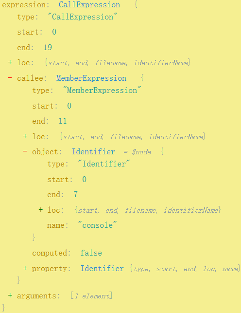
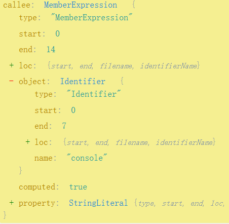
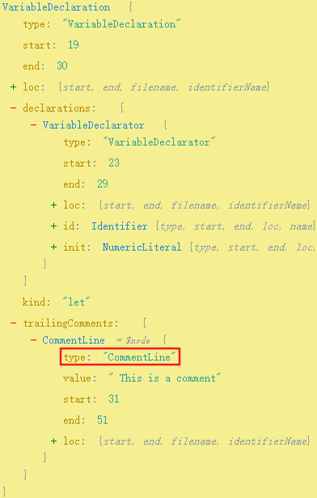
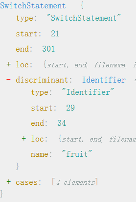
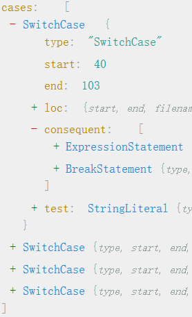

> The night is dark and full of terrors

# 0x01 Prerequisites

## Object Attribute Access

```js
console.log("test");
console["log"]("test");
```

对比两种对象属性访问方式下的AST

1. 点访问



2. 括号访问



`MemberExpression`下的`object`均`name`为`console`的`Identifier`

括号访问下`computed`为`true`，`property`为`StringLiteral`

点访问下`computed`为`false`，`property`为`Identifier`

通过AST将点访问改为括号访问(比用python正则改写太香了)

```js
const visitor = {
    MemberExpression(path){
        if(t.isIdentifier(path.node.property)) {
            let name = path.node.property.name;
            path.node.property = t.stringLiteral(name);
            path.node.computed = true;
        }
    }
};
```

```js
Date["prototype"]["format"] = function (formatStr) {
  var str = formatStr;
  var WEEK = ['日', '一', '二', '三', '四', '五', '六'];
  str = str["replace"](/yyyy|YYYY/, this["getFullYear"]())["replace"](/mm|MM/, this["getMonth"]() + 1 > 9 ? (this["getMonth"]() + 1)["toString"]() : '0' + (this["getMonth"]() + 1)["toString"]())["replace"](/dd|DD/, this["getDate"]() > 9 ? this["getDate"]()["toString"]() : '0' + this["getDate"]()["toString"]());
  return str;
};
console["log"](new Date()["format"]('yyyy-MM-dd'));
```

## JS Builtin Object

Date是JS中的标准内置对象，一般内置对象都是window下的属性，可以转化为`window["Date"]`这种形式

`t.memberExpression`的ts定义

```typescript
declare function memberExpression(object: Expression | Super, property: Expression | Identifier | PrivateName, computed?: boolean, optional?: true | false | null): MemberExpression;
```

```js
const visitor = {
    Identifier(path) {
        let name = path.node.name;
        let list = 'eval|parseInt|encodeURIComponent|Object|Function|Boolean|Number|Math|Date|String|RegExp|Array'.split('|');
        if(list.includes(name)){
            path.replaceWith(t.memberExpression(t.identifier('window'), t.stringLiteral(name), true));
        }
    }
};
```

```js
window["Date"]["prototype"]["format"] = function (formatStr) {
  var str = formatStr;
  var WEEK = ['日', '一', '二', '三', '四', '五', '六'];
  str = str["replace"](/yyyy|YYYY/, this["getFullYear"]())["replace"](/mm|MM/, this["getMonth"]() + 1 > 9 ? (this["getMonth"]() + 1)["toString"]() : '0' + (this["getMonth"]() + 1)["toString"]())["replace"](/dd|DD/, this["getDate"]() > 9 ? this["getDate"]()["toString"]() : '0' + this["getDate"]()["toString"]());
  return str;
};
console["log"](new window["Date"]()["format"]('yyyy-MM-dd'));
```

# 0x02 Constant and Identifier

## Number Constant Encrypt

* 遍历`NumericLiteral`节点，获取其value属性
* 随机生成一个数值记为key
* cipher = key ^ value
* value = cipher ^ key
* 替换节点为`BinaryExpression`
  * `left`: cipher
  * `operator`: ^
  * `right`: key

```js
const visitor = {
    NumericLiteral(path){
        let value = path.node.value;
        let key = parseInt(Math.random()*(999999-100000) + 100000, 10);
        let cipher = value ^ key;
        path.replaceWith(t.binaryExpression('^', t.numericLiteral(cipher), t.numericLiteral(key)));
        path.skip();  // 替换后的节点也会有NumericLiteral节点，会造成死循环
    }
};
```

```js
window["Date"]["prototype"]["format"] = function (formatStr) {
  var str = formatStr;
  var WEEK = ['日', '一', '二', '三', '四', '五', '六'];
  str = str["replace"](/yyyy|YYYY/, this["getFullYear"]())["replace"](/mm|MM/, this["getMonth"]() + (825965 ^ 825964) > (353620 ^ 353629) ? (this["getMonth"]() + (476755 ^ 476754))["toString"]() : '0' + (this["getMonth"]() + (164613 ^ 164612))["toString"]())["replace"](/dd|DD/, this["getDate"]() > (856356 ^ 856365) ? this["getDate"]()["toString"]() : '0' + this["getDate"]()["toString"]());
  return str;
};
console["log"](new window["Date"]()["format"]('yyyy-MM-dd'));
```

## String Constant Encrypt

* 遍历`StringLiteral`，获取其value属性
* base64.encode(value)
* 替换节点为base64.decode(value), 为一个`CallExpression`

```typescript
declare function callExpression(callee: Expression | Super | V8IntrinsicIdentifier, _arguments: Array<Expression | SpreadElement | JSXNamespacedName | ArgumentPlaceholder>): CallExpression;
```

* `callee`: 函数名，传入一个`Identifier`即可
* `_arguments`: 参数数组

```js
function encode(str){
    return btoa(unescape(encodeURIComponent(str))); // btoa不能编码中文
}

const visitor = {
    StringLiteral(path){
        let newStr = t.callExpression(t.identifier("atob"), [t.stringLiteral(encode(path.node.value))]);
        path.replaceWith(newStr);
        path.skip(); // 替换完后的节点也有StringLiteral节点, 会造成死循环
    }
};
```

```js
window[atob("RGF0ZQ==")][atob("cHJvdG90eXBl")][atob("Zm9ybWF0")] = function (formatStr) {
  var str = formatStr;
  var WEEK = [atob("5pel"), atob("5LiA"), atob("5LqM"), atob("5LiJ"), atob("5Zub"), atob("5LqU"), atob("5YWt")];
  str = str[atob("cmVwbGFjZQ==")](/yyyy|YYYY/, this[atob("Z2V0RnVsbFllYXI=")]())[atob("cmVwbGFjZQ==")](/mm|MM/, this[atob("Z2V0TW9udGg=")]() + (825965 ^ 825964) > (353620 ^ 353629) ? (this[atob("Z2V0TW9udGg=")]() + (476755 ^ 476754))[atob("dG9TdHJpbmc=")]() : atob("MA==") + (this[atob("Z2V0TW9udGg=")]() + (164613 ^ 164612))[atob("dG9TdHJpbmc=")]())[atob("cmVwbGFjZQ==")](/dd|DD/, this[atob("Z2V0RGF0ZQ==")]() > (856356 ^ 856365) ? this[atob("Z2V0RGF0ZQ==")]()[atob("dG9TdHJpbmc=")]() : atob("MA==") + this[atob("Z2V0RGF0ZQ==")]()[atob("dG9TdHJpbmc=")]());
  return str;
};
console[atob("bG9n")](new window[atob("RGF0ZQ==")]()[atob("Zm9ybWF0")](atob("eXl5eS1NTS1kZA==")));
```

## Array Index Confusion

* 遍历`StringLiteral`，获取其value属性
* 查看arr中是否存在该value(`arr.indexOf(value)`)
* 若arr存在该value，返回索引，否则将该value加入arr
* 替换节点为`CallExpression`
  * 函数名(`callee`)`Identifier`为`atob`
  * 参数数组(`_arguments`)为`MemberExpression`
    * arr[index]

上面的步骤将字符串都改成通过数组索引获取了，我们还需在代码最上面加上该数组，需要生成一个`ArrayExpression`数组表达式

```typescript
declare function arrayExpression(elements?: Array<null | Expression | SpreadElement>): ArrayExpression;
```

最后通过`unshift`插入到`program.body`的前面

```js
function encode(str){
    return btoa(unescape(encodeURIComponent(str))); // btoa不能编码中文
}
let bigArr = [];

const visitor = {
    StringLiteral(path){
        let cipher = encode(path.node.value);
        let bigArrIndex = bigArr.indexOf(cipher);
        let index = bigArrIndex;
        if(bigArrIndex == -1){
            let length = bigArr.push(cipher);
            index = length - 1;
        }
        let encStr = t.callExpression(t.identifier("atob"),[
            t.memberExpression(t.identifier('arr'), t.numericLiteral(index), true)
        ]);
        path.replaceWith(encStr);
    }
};
traverse(ast, visitor);
bigArr = bigArr.map(function(v){
    return t.stringLiteral(v);
});
bigArr = t.variableDeclarator(t.identifier('arr'), t.arrayExpression(bigArr));
bigArr = t.variableDeclaration('let', [bigArr]);
ast.program.body.unshift(bigArr);
let code = generator(ast).code;
```

```js
let arr = ["RGF0ZQ==", "cHJvdG90eXBl", "Zm9ybWF0", "5pel", "5LiA", "5LqM", "5LiJ", "5Zub", "5LqU", "5YWt", "cmVwbGFjZQ==", "Z2V0RnVsbFllYXI=", "Z2V0TW9udGg=", "dG9TdHJpbmc=", "MA==", "Z2V0RGF0ZQ==", "bG9n", "eXl5eS1NTS1kZA=="];
window[atob(arr[0])][atob(arr[1])][atob(arr[2])] = function (formatStr) {
  var str = formatStr;
  var WEEK = [atob(arr[3]), atob(arr[4]), atob(arr[5]), atob(arr[6]), atob(arr[7]), atob(arr[8]), atob(arr[9])];
  str = str[atob(arr[10])](/yyyy|YYYY/, this[atob(arr[11])]())[atob(arr[10])](/mm|MM/, this[atob(arr[12])]() + (825965 ^ 825964) > (353620 ^ 353629) ? (this[atob(arr[12])]() + (476755 ^ 476754))[atob(arr[13])]() : atob(arr[14]) + (this[atob(arr[12])]() + (164613 ^ 164612))[atob(arr[13])]())[atob(arr[10])](/dd|DD/, this[atob(arr[15])]() > (856356 ^ 856365) ? this[atob(arr[15])]()[atob(arr[13])]() : atob(arr[14]) + this[atob(arr[15])]()[atob(arr[13])]());
  return str;
};
console[atob(arr[16])](new window[atob(arr[0])]()[atob(arr[2])](atob(arr[17])));
```

## Array Shuffle Confusion

将数组乱序，新生成的代码中需要先对数组进行还原

`shuffle.js`用于还原数组，`parser.parse()`得到AST后，提取`program.body[0]`将其加入原AST的`program.body`前面

```js
// shuffle.js
(function(myArr, num){
    var shuffle = function(nums){
        while(--nums){
            myArr.push(myArr.shift());
        }
    };
    shuffle(++num);
}(arr, 0x10));
```

```js
function encode(str){
    return btoa(unescape(encodeURIComponent(str))); // btoa不能编码中文
}
let bigArr = [];

const visitor = {
    StringLiteral(path){
        let cipher = encode(path.node.value);
        let bigArrIndex = bigArr.indexOf(cipher);
        let index = bigArrIndex;
        if(bigArrIndex == -1){
            let length = bigArr.push(cipher);
            index = length - 1;
        }
        let encStr = t.callExpression(t.identifier("atob"),[
            t.memberExpression(t.identifier('arr'), t.numericLiteral(index), true)
        ]);
        path.replaceWith(encStr);
    }
};
traverse(ast, visitor);
(function(myArr, num){
    var shuffle = function(nums){
        while(--nums){
            myArr.unshift(myArr.pop());
        }
    };
    shuffle(++num);
}(bigArr, 0x10));  // 打乱数组
bigArr = bigArr.map(function(v){
    return t.stringLiteral(v);
});
const shuffle = fs.readFileSync("./shuffle.js", {encoding: "utf-8"});
const shuffleAst = parser.parse(shuffle);
ast.program.body.unshift(shuffleAst.program.body[0]);
bigArr = t.variableDeclarator(t.identifier('arr'), t.arrayExpression(bigArr));
bigArr = t.variableDeclaration('let', [bigArr]);
ast.program.body.unshift(bigArr);
let code = generator(ast).code;
```

```js
let arr = ["Zm9ybWF0", "5pel", "5LiA", "5LqM", "5LiJ", "5Zub", "5LqU", "5YWt", "cmVwbGFjZQ==", "Z2V0RnVsbFllYXI=", "Z2V0TW9udGg=", "dG9TdHJpbmc=", "MA==", "Z2V0RGF0ZQ==", "bG9n", "eXl5eS1NTS1kZA==", "RGF0ZQ==", "cHJvdG90eXBl"];
(function (myArr, num) {
  var shuffle = function (nums) {
    while (--nums) {
      myArr.push(myArr.shift());
    }
  };
  shuffle(++num);
})(arr, 0x10);
window[atob(arr[0])][atob(arr[1])][atob(arr[2])] = function (formatStr) {
  var str = formatStr;
  var WEEK = [atob(arr[3]), atob(arr[4]), atob(arr[5]), atob(arr[6]), atob(arr[7]), atob(arr[8]), atob(arr[9])];
  str = str[atob(arr[10])](/yyyy|YYYY/, this[atob(arr[11])]())[atob(arr[10])](/mm|MM/, this[atob(arr[12])]() + (825965 ^ 825964) > (353620 ^ 353629) ? (this[atob(arr[12])]() + (476755 ^ 476754))[atob(arr[13])]() : atob(arr[14]) + (this[atob(arr[12])]() + (164613 ^ 164612))[atob(arr[13])]())[atob(arr[10])](/dd|DD/, this[atob(arr[15])]() > (856356 ^ 856365) ? this[atob(arr[15])]()[atob(arr[13])]() : atob(arr[14]) + this[atob(arr[15])]()[atob(arr[13])]());
  return str;
};
console[atob(arr[16])](new window[atob(arr[0])]()[atob(arr[2])](atob(arr[17])));
```

## Hex Confusion

上面的数组顺序还原代码中，像push、shift这些方法可以转化为字符串，由于这段代码用于还原数组顺序，不能将其提取到大数组中，所以就简单将其编码为十六进制

```js
const shuffle = fs.readFileSync("./shuffle.js", {encoding: "utf-8"});
const shuffleAst = parser.parse(shuffle);
function hexEnc(str){
    for(var hexStr="",i=0,s;i<str.length;i++){
        s = str.charCodeAt(i).toString(16);
        hexStr += "\\x" + s;
    }
    return hexStr;
};
traverse(shuffleAst, {
    MemberExpression(path){
        if(t.isIdentifier(path.node.property)){
            let name = path.node.property.name;
            path.node.property = t.stringLiteral(hexEnc(name));
            path.node.computed = true;
        }
    }
})
code = code.replace(/\\\\x/g,'\\x');
```

```js
(function (myArr, num) {
  var shuffle = function (nums) {
    while (--nums) {
      myArr["\x70\x75\x73\x68"](myArr["\x73\x68\x69\x66\x74"]());
    }
  };
  shuffle(++num);
})(arr, 0x10);
```

Babel在处理节点时，会自动转义反斜杠，转成代码后，将其替换为单个斜杠即可。

unicode字符串实现方式一致，把hex编码的函数换成unicode编码的函数即可

## Identifier Confusion

一般情况下，标识符都是有语义的，根据标识符可以大致猜测出代码的意图，因此对标识符进行混淆是十分有必要的。上一节已经介绍了简单的标识符混淆，实际可以让各个函数内的标识符名相同，函数内部的局部标识符名还能与没被引用到的全局标识符名相同。

`Program`节点下使用`getOwnBinding`可以获取到全局标识符名

`FunctionExpression`和`FunctionDeclaration`使用`getOwnBinding`可以获取到函数自身定义的局部标识符名

```js
function renameOwnBinding(path) {
    let OwnBindingObj = {}, globalBindingObj = {}, i=0;
    path.traverse({
        Identifier(p){
            let name = p.node.name;
            let binding = p.scope.getOwnBinding(name);
            binding && generator(binding.scope.block).code == path + ''
             ? (OwnBindingObj[name] = binding) : (globalBindingObj[name] = 1);
        }
    });
    for(let oldName in OwnBindingObj) {
        do {
            var newName = '_0x2ba6ea' + i++;
        } while(globalBindingObj[newName]);
        OwnBindingObj[oldName].scope.rename(oldName, newName);
    }
};

const visitor = {
    'Program|FunctionExpression|FunctionDeclaration'(path){
        renameOwnBinding(path);
    }
};
traverse(ast, visitor);
```

* 遍历当前节点中所有的`Identifier`，`getOwnBinding`判断其`name`是否为当前节点自己的绑定
* 若`binding`为`undefined`，将其`name`放入`globalBindingObj`
* 若`binding`存在，将该标识符作为属性名，`binding`作为属性值，放入`OwnBindingObj`

```js
let _0x2ba6ea0 = ["Zm9ybWF0", "5pel", "5LiA", "5LqM", "5LiJ", "5Zub", "5LqU", "5YWt", "cmVwbGFjZQ==", "Z2V0RnVsbFllYXI=", "Z2V0TW9udGg=", "dG9TdHJpbmc=", "MA==", "Z2V0RGF0ZQ==", "bG9n", "eXl5eS1NTS1kZA==", "RGF0ZQ==", "cHJvdG90eXBl"];
(function (_0x2ba6ea0, _0x2ba6ea2) {
  var _0x2ba6ea3 = function (_0x2ba6ea1) {
    while (--_0x2ba6ea1) {
      _0x2ba6ea0["\x70\x75\x73\x68"](_0x2ba6ea0["\x73\x68\x69\x66\x74"]());
    }
  };
  _0x2ba6ea3(++_0x2ba6ea2);
})(_0x2ba6ea0, 0x10);
window[atob(_0x2ba6ea0[0])][atob(_0x2ba6ea0[1])][atob(_0x2ba6ea0[2])] = function (_0x2ba6ea1) {
  var _0x2ba6ea2 = _0x2ba6ea1;
  var _0x2ba6ea3 = [atob(_0x2ba6ea0[3]), atob(_0x2ba6ea0[4]), atob(_0x2ba6ea0[5]), atob(_0x2ba6ea0[6]), atob(_0x2ba6ea0[7]), atob(_0x2ba6ea0[8]), atob(_0x2ba6ea0[9])];
  _0x2ba6ea2 = _0x2ba6ea2[atob(_0x2ba6ea0[10])](/yyyy|YYYY/, this[atob(_0x2ba6ea0[11])]())[atob(_0x2ba6ea0[10])](/mm|MM/, this[atob(_0x2ba6ea0[12])]() + (825965 ^ 825964) > (353620 ^ 353629) ? (this[atob(_0x2ba6ea0[12])]() + (476755 ^ 476754))[atob(_0x2ba6ea0[13])]() : atob(_0x2ba6ea0[14]) + (this[atob(_0x2ba6ea0[12])]() + (164613 ^ 164612))[atob(_0x2ba6ea0[13])]())[atob(_0x2ba6ea0[10])](/dd|DD/, this[atob(_0x2ba6ea0[15])]() > (856356 ^ 856365) ? this[atob(_0x2ba6ea0[15])]()[atob(_0x2ba6ea0[13])]() : atob(_0x2ba6ea0[14]) + this[atob(_0x2ba6ea0[15])]()[atob(_0x2ba6ea0[13])]());
  return _0x2ba6ea2;
};
console[atob(_0x2ba6ea0[16])](new window[atob(_0x2ba6ea0[0])]()[atob(_0x2ba6ea0[2])](atob(_0x2ba6ea0[17])));
```

## Random Indentifier

上面重命名标识符都是`_0x2ba6ea`加上一个自增数字来作为新的标识符名，现在使用大写字母O、小写字母o和数字0三个字符来组成标识符名

```js
function generateIdentifier(decNum) {
    let flag = ['O', 'o', '0'];
    let retval = [];
    while(decNum>0){
        retval.push(decNum%3);
        decNum = parseInt(decNum / 3);
    }
    let identifier = retval.reverse().map(function(v){
        return flag[v];
    }).join('');
    identifier.length < 6 ? (identifier = ('OOOOOO' + identifier).substr(-6)):
    identifier[0] == '0' && (identifier = 'O' + identifier);
    return identifier;
}
```

将十进制转三进制，把0、1、2分别用大写字母O、小写字母o、数字0来替换

retval存储是倒序的余数，通过map把余数0、1、2映射到对于的大写字母O、小写字母o、数字0

对于长度小于6的标识符，用大写字母O或小写字母o补全位数

对于长度大于等于6且第一个字符串是0的标识符，往前补一个大写字母O或小写字母o(标识符不能以数字开头)

将`var newName = '_0x2ba6ea' + i++;`换成`var newName = generateIdentifier(i++);`即可

```js
let OOOOOO = ["Zm9ybWF0", "5pel", "5LiA", "5LqM", "5LiJ", "5Zub", "5LqU", "5YWt", "cmVwbGFjZQ==", "Z2V0RnVsbFllYXI=", "Z2V0TW9udGg=", "dG9TdHJpbmc=", "MA==", "Z2V0RGF0ZQ==", "bG9n", "eXl5eS1NTS1kZA==", "RGF0ZQ==", "cHJvdG90eXBl"];
(function (OOOOOO, OOOOOOo) {
  var OOOOOO0 = function (OOOOOOo) {
    while (--OOOOOOo) {
      OOOOOO["\x70\x75\x73\x68"](OOOOOO["\x73\x68\x69\x66\x74"]());
    }
  };
  OOOOOO0(++OOOOOOo);
})(OOOOOO, 0x10);
window[atob(OOOOOO[0])][atob(OOOOOO[1])][atob(OOOOOO[2])] = function (OOOOOOo) {
  var OOOOOO0 = OOOOOOo;
  var OOOOOOoO = [atob(OOOOOO[3]), atob(OOOOOO[4]), atob(OOOOOO[5]), atob(OOOOOO[6]), atob(OOOOOO[7]), atob(OOOOOO[8]), atob(OOOOOO[9])];
  OOOOOO0 = OOOOOO0[atob(OOOOOO[10])](/yyyy|YYYY/, this[atob(OOOOOO[11])]())[atob(OOOOOO[10])](/mm|MM/, this[atob(OOOOOO[12])]() + (825965 ^ 825964) > (353620 ^ 353629) ? (this[atob(OOOOOO[12])]() + (476755 ^ 476754))[atob(OOOOOO[13])]() : atob(OOOOOO[14]) + (this[atob(OOOOOO[12])]() + (164613 ^ 164612))[atob(OOOOOO[13])]())[atob(OOOOOO[10])](/dd|DD/, this[atob(OOOOOO[15])]() > (856356 ^ 856365) ? this[atob(OOOOOO[15])]()[atob(OOOOOO[13])]() : atob(OOOOOO[14]) + this[atob(OOOOOO[15])]()[atob(OOOOOO[13])]());
  return OOOOOO0;
};
console[atob(OOOOOO[16])](new window[atob(OOOOOO[0])]()[atob(OOOOOO[2])](atob(OOOOOO[17])));
```

# 0x03 Blocks

## BinExpr 2 Junk Code

花指令用来尽可能隐藏源代码的真实意图

下面用AST实现二项式转函数和函数调用表达式转函数

```js
function xxx(a, b){
    return a + b;
}
xxx(c, d);  // c + d
```

```js
function xxx(a, b){
    return a(b);
}
xxx(c, d);  // c(d);
```

实现思路:

* 遍历`BinaryExpression`节点，取出`operator`、`left`和`right`
* 生成一个函数，函数名不能和当前节点的标识符冲突。参数固定为a和b，返回原来的`BinaryExpression`
* 找到最近的`BlockStatement`节点，将生成的函数加入到`body`数组的最前面
* 原生的`BinaryExpression`替换为`CallExpression`，`callee`为函数名，`_arguments`为原二项式的`left`和`right`

新生成的函数的标识符可以随机设置，因为最后还要进行标识符混淆。

为了更好地增大代码量，遇到相同的二项式(比如都是加法二项式)不进行`operator`的判断，直接生成新的函数。

```js
let visitor = {
    BinaryExpression(path) {
        let operator = path.node.operator;
        let left = path.node.left;
        let right = path.node.right;
        let a = t.identifier('a');
        let b = t.identifier('b');
        let funcName = path.scope.generateUidIdentifier('xxx');
        let func = t.functionDeclaration(
            funcName, [a,b],
            t.blockStatement([t.returnStatement(t.binaryExpression(operator, a, b))])
        );
        let nearBlock = path.findParent(function(p){
            return p.isBlockStatement();
        }); // 找最近的BlockStatement
        nearBlock.node.body.unshift(func);
        path.replaceWith(t.callExpression(funcName, [left, right]));
    }
}
```

```js
Date.prototype.format = function (formatStr) {
  function _xxx7(a, b) {
    return a + b;
  }
  function _xxx6(a, b) {
    return a > b;
  }
  function _xxx5(a, b) {
    return a + b;
  }
  function _xxx4(a, b) {
    return a + b;
  }
  function _xxx3(a, b) {
    return a + b;
  }
  function _xxx2(a, b) {
    return a + b;
  }
  function _xxx(a, b) {
    return a > b;
  }
  var str = formatStr;
  var WEEK = ['日', '一', '二', '三', '四', '五', '六'];
  str = str.replace(/yyyy|YYYY/, this.getFullYear()).replace(/mm|MM/, _xxx(_xxx2(this.getMonth(), 1), 9) ? _xxx3(this.getMonth(), 1).toString() : _xxx4('0', _xxx5(this.getMonth(), 1).toString())).replace(/dd|DD/, _xxx6(this.getDate(), 9) ? this.getDate().toString() : _xxx7('0', this.getDate().toString()));
  return str;
};
console.log(new Date().format('yyyy-MM-dd'));
```

## Eval Encrypt

先把代码转字符串，再把字符串加密后传入解密函数，解密得出的明文传入eval执行

* 遍历`FunctionExpression`节点，`path.node.body`即`BlockStatement`节点。`BlockStatement.body`是一个数组，每个元素对应函数的一行语句。
* `generator(v).node`将函数中每一行语句转化为字符串，接着对字符串进行加密，这里简单地进行Base64编码。
* 对于return语句直接返回，不进行加密
* 所有语句处理完后新建一个`BlockStatement`替换原来的节点

```js
function encode(str){
    return btoa(unescape(encodeURIComponent(str))); // btoa不能编码中文
}
let visitor = {
    FunctionExpression(path){
        let blockStatement = path.node.body;
        let statements = blockStatement.body.map(function(v){
            if(t.isReturnStatement(v)) return v;
            let code = generator(v).code;
            let cipher = encode(code);
            let decryptFunc = t.callExpression(t.identifier('atob'),[t.stringLiteral(cipher)]);
            return t.expressionStatement(t.callExpression(t.identifier('eval'),[decryptFunc]));
        });
        path.get('body').replaceWith(t.blockStatement(statements));
    }
}
```

```js
Date.prototype.format = function (formatStr) {
  eval(atob("dmFyIHN0ciA9IGZvcm1hdFN0cjs="));
  eval(atob("dmFyIFdFRUsgPSBbJ+aXpScsICfkuIAnLCAn5LqMJywgJ+S4iScsICflm5snLCAn5LqUJywgJ+WFrSddOw==")); eval(atob("c3RyID0gc3RyLnJlcGxhY2UoL3l5eXl8WVlZWS8sIHRoaXMuZ2V0RnVsbFllYXIoKSkucmVwbGFjZSgvbW18TU0vLCB0aGlzLmdldE1vbnRoKCkgKyAxID4gOSA/ICh0aGlzLmdldE1vbnRoKCkgKyAxKS50b1N0cmluZygpIDogJzAnICsgKHRoaXMuZ2V0TW9udGgoKSArIDEpLnRvU3RyaW5nKCkpLnJlcGxhY2UoL2RkfERELywgdGhpcy5nZXREYXRlKCkgPiA5ID8gdGhpcy5nZXREYXRlKCkudG9TdHJpbmcoKSA6ICcwJyArIHRoaXMuZ2V0RGF0ZSgpLnRvU3RyaW5nKCkpOw=="));
  return str;
};
console.log(new Date().format('yyyy-MM-dd'));
```

emmm，混淆得到的代码特征太明显了，好几个eval，不建议大规模使用，但可以用来混淆部分代码。源码中可以在需混淆的地方加上注释

```js
function test(){
  let a = 15; // This is a comment
}
```



生成的AST多了一个`TrailingComments`节点，表示行尾注释，是一个`CommentLine`数组，eval加密中可以判断有注释且注释为`evalEncrypt`才进行加密。很奇怪下一个节点还会多出一个`LeadingComments`，这个也要删掉

```js
let statements = blockStatement.body.map(function(v, inx){
    if(t.isReturnStatement(v)) return v;
    if(!(v.trailingComments && v.trailingComments[0].value == ' evalEncrypt')) return v;
    delete v.trailingComments;
    delete blockStatement.body[inx + 1].leadingComments;
    let code = generator(v).code;
    let cipher = encode(code);
    let decryptFunc = t.callExpression(t.identifier('atob'),[t.stringLiteral(cipher)]);
    return t.expressionStatement(t.callExpression(t.identifier('eval'),[decryptFunc]));
});
```

```js
Date.prototype.format = function (formatStr) {
  var str = formatStr;
  var WEEK = ['日', '一', '二', '三', '四', '五', '六'];
  // 原代码 str = str.replace(/yyyy|YYYY/, this.getFullYear()) // evalEncrypt
  eval(atob("c3RyID0gc3RyLnJlcGxhY2UoL3l5eXl8WVlZWS8sIHRoaXMuZ2V0RnVsbFllYXIoKSk7"));
  str = str.replace(/mm|MM/, this.getMonth() + 1 > 9 ? (this.getMonth() + 1).toString() : '0' + (this.getMonth() + 1).toString());
  str = str.replace(/dd|DD/, this.getDate() > 9 ? this.getDate().toString() : '0' + this.getDate().toString());
  return str;
};
console.log(new Date().format('yyyy-MM-dd'));
```

除了上面用base64加密原代码，还可以用charCodeAt将字符串转到ASCII，再用`String.fromCharCode`还原，最后用eval来执行

```js
let visitor = {
    FunctionExpression(path){
        let blockStatement = path.node.body;
        let statements = blockStatement.body.map(function(v, inx){
            if(t.isReturnStatement(v)) return v;
            if(!(v.trailingComments && v.trailingComments[0].value == ' asciiEncrypt')) return v;
            delete v.trailingComments;
            delete blockStatement.body[inx + 1].leadingComments;
            let code = generator(v).code;
            let ascii = [].map.call(code, function(v){
                return t.numericLiteral(v.charCodeAt(0));
            });
            let decryptFunc = t.memberExpression(t.identifier('String'), t.identifier('fromCharCode'));
            let decrypt = t.callExpression(decryptFunc, ascii);
            return t.expressionStatement(t.callExpression(t.identifier('eval'),[decrypt]));
        });
        path.get('body').replaceWith(t.blockStatement(statements));
    }
}
```

字符串在JS中是只读数组，但不能直接调用数组的map，所以使用`[].map.call`来间接调用

```js
Date.prototype.format = function (formatStr) {
  var str = formatStr;
  var WEEK = ['日', '一', '二', '三', '四', '五', '六'];
  eval(String.fromCharCode(115, 116, 114, 32, 61, 32, 115, 116, 114, 46, 114, 101, 112, 108, 97, 99, 101, 40, 47, 121, 121, 121, 121, 124, 89, 89, 89, 89, 47, 44, 32, 116, 104, 105, 115, 46, 103, 101, 116, 70, 117, 108, 108, 89, 101, 97, 114, 40, 41, 41, 59));
  str = str.replace(/mm|MM/, this.getMonth() + 1 > 9 ? (this.getMonth() + 1).toString() : '0' + (this.getMonth() + 1).toString());
  str = str.replace(/dd|DD/, this.getDate() > 9 ? this.getDate().toString() : '0' + this.getDate().toString());
  return str;
};
console.log(new Date().format('yyyy-MM-dd'));
```

使用eval加密，要在标识符混淆之后

整合上面这些混淆方案，代码已上传至仓库👉[点我](../code/demo.js)

混淆效果如下:

```js
var OOOOOO = ["Zm9ybWF0", "5pel", "5LiA", "5LqM", "5LiJ", "5Zub", "5LqU", "5YWt", "cmVwbGFjZQ==", "Z2V0RnVsbFllYXI=", "Z2V0TW9udGg=", "dG9TdHJpbmc=", "MA==", "Z2V0RGF0ZQ==", "bG9n", "eXl5eS1NTS1kZA==", "RGF0ZQ==", "cHJvdG90eXBl"];
(function (OOOOOO, OOOOOo) {
  var OOOOO0 = function (OOOOOo) {
    while (--OOOOOo) {
      OOOOOO["\x70\x75\x73\x68"](OOOOOO["\x73\x68\x69\x66\x74"]());
    }
  };
  OOOOO0(++OOOOOo);
})(OOOOOO, 872716 ^ 872732);
window[window["atob"](OOOOOO[717968 ^ 717968])][window["atob"](OOOOOO[586394 ^ 586395])][window["atob"](OOOOOO[510921 ^ 510923])] = function (OOOOOo) {
  function OOOoOo(OOOOOO, OOOOOo) {
    return OOOOOO + OOOOOo;
  }
  function OOOoOO(OOOOOO, OOOOOo) {
    return OOOOOO > OOOOOo;
  }
  function OOOO00(OOOOOO, OOOOOo) {
    return OOOOOO + OOOOOo;
  }
  function OOOO0o(OOOOOO, OOOOOo) {
    return OOOOOO + OOOOOo;
  }
  function OOOO0O(OOOOOO, OOOOOo) {
    return OOOOOO + OOOOOo;
  }
  function OOOOo0(OOOOOO, OOOOOo) {
    return OOOOOO + OOOOOo;
  }
  function OOOOoo(OOOOOO, OOOOOo) {
    return OOOOOO > OOOOOo;
  }
  var OOOOO0 = OOOOOo;
  var OOOOoO = [window["atob"](OOOOOO[488551 ^ 488548]), window["atob"](OOOOOO[104196 ^ 104192]), window["atob"](OOOOOO[483031 ^ 483026]), window["atob"](OOOOOO[231659 ^ 231661]), window["atob"](OOOOOO[846362 ^ 846365]), window["atob"](OOOOOO[881120 ^ 881128]), window["atob"](OOOOOO[589345 ^ 589352])];
  eval(String.fromCharCode(499495 ^ 499560, 789675 ^ 789732, 795756 ^ 795683, 207762 ^ 207837, 629467 ^ 629396, 461913 ^ 461929, 680418 ^ 680386, 422879 ^ 422882, 488087 ^ 488119, 246218 ^ 246149, 806135 ^ 806072, 141335 ^ 141400, 570436 ^ 570379, 865111 ^ 865048, 582670 ^ 582718, 998485 ^ 998414, 870923 ^ 871036, 867613 ^ 867700, 647384 ^ 647350, 118823 ^ 118851, 895863 ^ 895768, 669069 ^ 669178, 718134 ^ 718189, 679134 ^ 679164, 848957 ^ 848988, 504010 ^ 503998, 319752 ^ 319847, 867557 ^ 867463, 701169 ^ 701139, 306457 ^ 306500, 560255 ^ 560215, 914615 ^ 914680, 709867 ^ 709796, 675931 ^ 675860, 230638 ^ 230561, 662583 ^ 662648, 536637 ^ 536690, 396891 ^ 396800, 732276 ^ 732229, 369814 ^ 369830, 891599 ^ 891538, 114691 ^ 114730, 261380 ^ 261465, 183820 ^ 183844, 883104 ^ 883087, 505830 ^ 505759, 987734 ^ 987695, 672456 ^ 672433, 692091 ^ 691970, 353811 ^ 353903, 699194 ^ 699235, 559058 ^ 558987, 178863 ^ 178934, 475482 ^ 475395, 999963 ^ 999988, 910447 ^ 910403, 960280 ^ 960312, 509522 ^ 509478, 289923 ^ 290027, 235446 ^ 235487, 856815 ^ 856732, 472273 ^ 472202, 497690 ^ 497773, 391511 ^ 391486, 985797 ^ 985771, 806489 ^ 806461, 259664 ^ 259647, 556470 ^ 556481, 258429 ^ 258342, 415226 ^ 415192, 878750 ^ 878847, 637267 ^ 637223, 216032 ^ 215951, 157204 ^ 157302, 215841 ^ 215811, 981396 ^ 981449, 317202 ^ 317242, 828019 ^ 827964, 798575 ^ 798496, 873908 ^ 873979, 324348 ^ 324275, 702649 ^ 702710, 602497 ^ 602574, 241619 ^ 241544, 631082 ^ 631067, 303951 ^ 303998, 361879 ^ 361930, 631767 ^ 631806, 479245 ^ 479312, 783703 ^ 783743, 247122 ^ 247163, 400295 ^ 400270, 383694 ^ 383733));
  OOOOO0 = OOOOO0[window["atob"](OOOOOO[882918 ^ 882924])](/mm|MM/, OOOOoo(OOOOo0(this[window["atob"](OOOOOO[279841 ^ 279853])](), 612035 ^ 612034), 236918 ^ 236927) ? OOOO0O(this[window["atob"](OOOOOO[529813 ^ 529817])](), 539303 ^ 539302)[window["atob"](OOOOOO[569281 ^ 569292])]() : OOOO0o(window["atob"](OOOOOO[492661 ^ 492667]), OOOO00(this[window["atob"](OOOOOO[784034 ^ 784046])](), 847076 ^ 847077)[window["atob"](OOOOOO[425969 ^ 425980])]()));
  eval(atob("T09PT08wID0gT09PT08wW3dpbmRvd1siYXRvYiJdKE9PT09PT1sxMF0pXSgvZGR8REQvLCBPT09vT08odGhpc1t3aW5kb3dbImF0b2IiXShPT09PT09bMTVdKV0oKSwgOSkgPyB0aGlzW3dpbmRvd1siYXRvYiJdKE9PT09PT1sxNV0pXSgpW3dpbmRvd1siYXRvYiJdKE9PT09PT1sxM10pXSgpIDogT09Pb09vKHdpbmRvd1siYXRvYiJdKE9PT09PT1sxNF0pLCB0aGlzW3dpbmRvd1siYXRvYiJdKE9PT09PT1sxNV0pXSgpW3dpbmRvd1siYXRvYiJdKE9PT09PT1sxM10pXSgpKSk7"));
  return OOOOO0;
};
console[window["atob"](OOOOOO[764386 ^ 764402])](new window[window["atob"](OOOOOO[845325 ^ 845325])]()[window["atob"](OOOOOO[595543 ^ 595541])](window["atob"](OOOOOO[356356 ^ 356373])));
```

# 0x04 Execution Flow

## Control Flow Flattening

打乱语句顺序，将其放入switch语句中，再通过循环遍历分发器来决定执行顺序

首先看一下switch语句对应的AST结构

```js
let fruit = "apple";
switch (fruit) {
  case "banana":
    console.log("This is a banana.");
    break;
  case "apple":
    console.log("This is an apple.");
    break;
  case "orange":
    console.log("This is an orange.");
    break;
  default:
    console.log("I don't know what fruit this is.");
}
```



* `SwitchStatement` switch语句
* `discriminant`: 判别式，为`Identifier`
* `cases`: case分支，是一个数组



* `SwitchCase` case语句
* `test` case后面跟着的匹配值
* `consequent` 存在case语句块中的具体语句, 是一个数组

```js
const visitor = {
    FunctionExpression(path){
        let blockStatement = path.node.body;
        let statsments = blockStatement.body.map(function(v, i){
            return {index:i, value: v} // 保存了原执行顺序
        });
        statsments.sort(() => Math.random() - 0.5); // 打乱数组
        let cases = [];
        let dispenserArr = []; // 分发器
        statsments.map(function(v, i){
            dispenserArr[v.index] = i;
            let switchCase = t.switchCase(t.numericLiteral(i), [v.value, t.continueStatement()]);
            cases.push(switchCase);
        });
        let dispenserStr = dispenserArr.join('|');
        
        let array = path.scope.generateUidIdentifier('array');
        let index = path.scope.generateUidIdentifier('index');
        // 生成'xxx'.split('|')
        let disArrayInit = t.callExpression(t.memberExpression(t.stringLiteral(dispenserStr), t.identifier('split')),
        [t.stringLiteral('|')]);
        
        let varArray = t.variableDeclarator(array, disArrayInit);
        let varIndex = t.variableDeclarator(index, t.numericLiteral(0));

        // let array_x = 'xxx'.split('|'), index_x = 0;
        let dispenser = t.variableDeclaration('let', [varArray, varIndex]);

        //  + array_x[index_x++]
        let updExp = t.updateExpression('++', index);
        let memExp = t.memberExpression(array, updExp, true);
        let discriminant = t.unaryExpression('+', memExp); // 加号将字符串转数字
        
        // 构建Switch语句
        let switchState = t.switchStatement(discriminant, cases);

        // while(!![]){switch(){};break;}
        let unaExp = t.unaryExpression('!', t.arrayExpression());
        unaExp = t.unaryExpression('!', unaExp);
        let whileState = t.whileStatement(unaExp, t.blockStatement([
            switchState, t.breakStatement()
        ]));

        // 分发器和循环语句替换原有节点
        path.get('body').replaceWith(t.blockStatement([dispenser, whileState]));
    }
}
```

* 遍历`FunctionExpression`, 其`body`为`BlockStatement`, 获取`BlockStatement`的`body`数组, 提取索引和值, 这个索引就是代码的执行顺序
* 接着打乱数组, 构造`SwitchCase`语句, 每条语句为打乱后的元素跟上continue语句
* 构造分发器, 决定`SwitchCase`语句的执行顺序
* 构造while死循环和`SwitchStatement`声明语句
* while循环由`switchStatement`和break语句构成

```js
Date.prototype.format = function (formatStr) {
  let _array = "3|5|0|1|4|2".split("|"),
    _index = 0;
  while (!![]) {
    switch (+_array[_index++]) {
      case 0:
        str = str.replace(/yyyy|YYYY/, this.getFullYear());
        continue;
      case 1:
        str = str.replace(/mm|MM/, this.getMonth() + 1 > 9 ? (this.getMonth() + 1).toString() : '0' + (this.getMonth() + 1).toString());
        continue;
      case 2:
        return str;
        continue;
      case 3:
        var str = formatStr;
        continue;
      case 4:
        str = str.replace(/dd|DD/, this.getDate() > 9 ? this.getDate().toString() : '0' + this.getDate().toString());
        continue;
      case 5:
        var WEEK = ['日', '一', '二', '三', '四', '五', '六'];
        continue;
    }
    break;
  }
};
console.log(new Date().format('yyyy-MM-dd'));
```

控制流平坦化需要和其他混淆方案一起使用。如case后面跟的值可以用数值常量加密，分发器中的字符串可以用字符串加密

## Comma Expression

逗号运算符把多个表达式或语句连成一个复合语句

考虑几种语句之间的连接: 声明语句与声明语句、普通语句与return语句

* 声明语句之间的连接

```js
var a = 100;
var b = 200;
// var a = 100, b = 200; √
// var a = 100, var b = 200 ×
```

要连接两个声明语句，需要提取出`VariableDeclaration`的`declarations`数组，该数组是声明语句中定义的变量，再将其处理为一条声明语句

* 普通语句与return语句之间的连接

```js
function test(a){
    a = a + 100;
    return a;
}
// return a = a + 100, a;  √
// a = a + 100, return a;  ×
```

普通语句和return语句连接时，需要提取出return语句的argument

需要把变量声明都放到函数的形参，JS允许参数实参和形参数量不一致，没有传入实参为`undefined`

```js
let visitor = {
    FunctionExpression(path){
        let blockStatement = path.node.body;
        let blockStatementLength = blockStatement.body.length;
        if(blockStatementLength < 2) return;
        // 提取所有生成的变量到参数列表
        path.traverse({
            VariableDeclaration(p){
                declarations = p.node.declarations;
                let statements = [];
                declarations.map(function(v){
                    path.node.params.push(v.id);
                    v.init && statements.push(t.assignmentExpression('=', v.id, v.init));
                });
                p.replaceInline(statements);
            }
        })
    }
}
```

* 遍历`FunctionExpression`节点，取出`BlockStatement`节点的`body`，是一个数组存放中函数里面每一条语句。若语句少于两条则不做处理
* 遍历当前函数下的所有`VariableDeclaration`节点，获取其`declarations`，为`VariableDeclarator`数组
* 将`VariableDeclarator`的id即`Identifier`放到函数参数数组中。若原变量声明语句有初始化(`init`不为null)，构造赋值语句`AssignmentExpression`加入`statements`数组，最后替换原变量声明语句

有时候函数体中的语句外面包裹着一层`ExpressionStatement`节点，会影响语句类型的判断，需要将外层`ExpressionStatement`去掉

逗号表达式可以使用`toSequenceExpression`完成

* 若`secondState`是返回语句，构造`returnStatement`

  直接`return firstStatement, secondStatement.argument `

  argument为跟在return后面的内容

* 若`secondState`是赋值语句

  * 若`secondState.right`是函数调用表达式，提取其`callee`，构造

    `(firstState, callee.object).(callee.property)(arguments)`

  * 若`secondState.right`不是函数调用表达式，让`secondState.right`为逗号表达式

    即`secondState.left = firstState, secondState.right `

    由于逗号表达式返回最后一条语句，因此转化前后结果一样

* 其他情况直接添加到逗号表达式后面

```js
let visitor = {
    FunctionExpression(path){
        let blockStatement = path.node.body;
        let blockStatementLength = blockStatement.body.length;
        if(blockStatementLength < 2) return;
        // 提取所有生成的变量到参数列表
        path.traverse({
            VariableDeclaration(p){
                declarations = p.node.declarations;
                let statements = [];
                declarations.map(function(v){
                    path.node.params.push(v.id);
                    v.init && statements.push(t.assignmentExpression('=', v.id, v.init));
                });
                p.replaceInline(statements);
            }
        });
        let firstState = blockStatement.body[0], i = 1;
        while(i < blockStatementLength) {
            let secondState = blockStatement.body[i++];
            if(t.isExpressionStatement(secondState))
                secondState = secondState.expression;
            // 处理返回语句
            if(t.isReturnStatement(secondState)){
                firstState = t.returnStatement(t.toSequenceExpression([firstState, secondState.argument]));
            } else if(t.isAssignmentExpression(secondState)){
                if(t.isCallExpression(secondState.right)){
                    let callee = secondState.right.callee;
                    callee.object = t.toSequenceExpression([firstState, callee.object]);
                    firstState = secondState;
                } else {
                    secondState.right = t.toSequenceExpression([firstState, secondState.right]);
                    firstState = secondState;
                }
            } else {
                firstState = t.toSequenceExpression([firstState, secondState]);
            }
        }
        path.get('body').replaceWith(t.blockStatement([firstState]));
    } 
}
```

```js
Date.prototype.format = function (formatStr, str, WEEK) {
  return str = (str = (str = (WEEK = (str = formatStr, ['日', '一', '二', '三', '四', '五', '六']), str).replace(/yyyy|YYYY/, this.getFullYear()), str).replace(/mm|MM/, this.getMonth() + 1 > 9 ? (this.getMonth() + 1).toString() : '0' + (this.getMonth() + 1).toString()), str).replace(/dd|DD/, this.getDate() > 9 ? this.getDate().toString() : '0' + this.getDate().toString()), str;
};
console.log(new Date().format('yyyy-MM-dd'));
```

逗号表达式混淆的实现比较复杂，实际还得考虑更多情况


